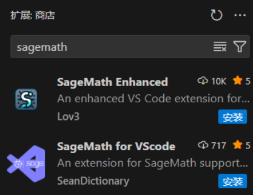

# SageMath 安装

SageMath 是一个开源的数学软件系统，它整合了多种开源数学软件包，提供了一个统一的、Python 基础的界面。在密码学研究和实践中，SageMath 提供了强大的工具支持，特别是对于复杂的数学运算和算法的实现。

SageMath 可以通过多种方式安装，主要使用的有 Windows 版本的 9.3（win 版本已经停更，后续更新版本不再制作 Win 平台的软件包）和 Linux/WSL2 版本的 10.6，部分运算的性能上 10.6 会优于 9.3 版本。

## Windows

SageMath 不在官网中提供 Windows 的二进制文件下载，需要在其 github 官方发布页中下载。Windows 版本的安装可以参考[https://github.com/sagemath/sage-windows-cygwin/releases](https://github.com/sagemath/sage-windows-cygwin/releases)。

Windows 的 SageMath 实际上是用虚拟环境来模拟 Linux，并在虚拟环境上运行 SageMath。所以需要使用软件自带的命令行终端来执行命令或运行 Sage 文件等等功能。此外还提供了一个基于浏览器的 Jupyter Notebook 界面，可以在其中编写和运行 Sage 代码。启动时会自动连接只虚拟环境下的 SageMath 的 Jupyter 内核，因此可以在 Jupyter 界面直接运行 Sage 代码。

在 Sage 终端下使用 `sage hello.sage`来运行 Sage 文件，或者使用 `sage -python hello.py`来运行 Python 文件。也可以在该终端下使用 `pip install <package>`来安装第三方 Python 包，例如 `pycryptodome`等。

## Linux/WSL2

Linux/WSL2 版本的安装可以参考[https://doc.sagemath.org/html/en/installation/index.html#windows](https://doc.sagemath.org/html/en/installation/index.html#windows)。

你可以直接使用包管理器安装 SageMath，例如 `apt install sagemath`，或者使用源码编译安装（此方法极度不建议，因为 Linux 环境自带 Python，而通常该版本和 SageMath 依赖的版本不一致，会导致系统环境混乱，容易出现冲突错误）。除此以外你可以按照官方的安装步骤，使用 Miniforge 来创建一个新的 Python 环境，然后在该环境中安装 SageMath。这会隔离 SageMath 和系统 Python 的依赖关系，避免冲突，且易于管理。

### 具体操作

使用`wsl --list --onlie`查看在线可用Linux发行版

使用`wsl --install`安装默认Ubuntu分发版，也可以使用`--distribution`参数指定安装Linux发行版本

> 如果电脑硬件不支持虚拟化（久远的老古董）可以使用`wsl --set-default-version 1`然后一样的安装方式。

一般建议安装 Ubuntu-20.04 或者 Ubuntu-22.04

安装完成后就会弹出Ubuntu的命令行页面

参考SageMath官网，使用下述命令安装Miniforge和SageMath

```
$ curl -L -O "https://github.com/conda-forge/miniforge/releases/latest/download/Miniforge3-$(uname)-$(uname -m).sh"
$ bash Miniforge3-$(uname)-$(uname -m).sh
$ conda create -n sage sage python=3.11
```

如果最后一条命令运行时出现`conda not found`报错，重新打开终端就行输入`bash`或者`zsh`根据具体终端使用

给VScode安装Sage插件，下面两个都挺不错的



或者手动在终端中运行sage文件也行，使用如下命令

```
conda activate sage
sage exp.sage
```

该平台下，SageMath 的使用方法和 Windows 一样，可以直接在启动了 Sage 的环境下运行 Sage 文件（如果你没用虚拟环境，那就可以直接在终端运行），此外 SageMath 同样提供了 Jupyter Notebook 的支持，可以在其中编写和运行 Sage 代码。