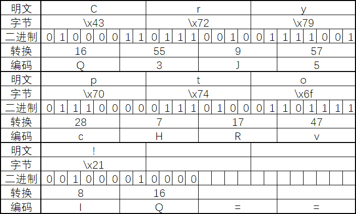

# Base64

虽然这个编码和密码无关，但是实际使用中还是比较常见的，虽然可以直接用已有的库，但是理解一下原理也不差。



常用的 Base64 替换表是 `A-Za-z0-9+/=`

对于明文 `Crypto!`来说，三个字节一组用 Base64 编码，最后缺的位置用替换表最后一个即=补齐

对于每一组，转化为二进制然后再 6 个一组转换为整数，然后作为索引从替换表内取字符组合作为编码结果

最终编码结果就是 `Q3J5cHRvIQ==`

实际使用中可以直接用 python 的库，用法如下

```python
import base64

plain = b"Crypto!"
cipher = base64.b64encode(plain)
print(cipher)    b'Q3J5cHRvIQ=='
plain = base64.b64decode(cipher)
print(plain)     b'Crypto!'
```

或者使用赛博厨刀的魔法棒
