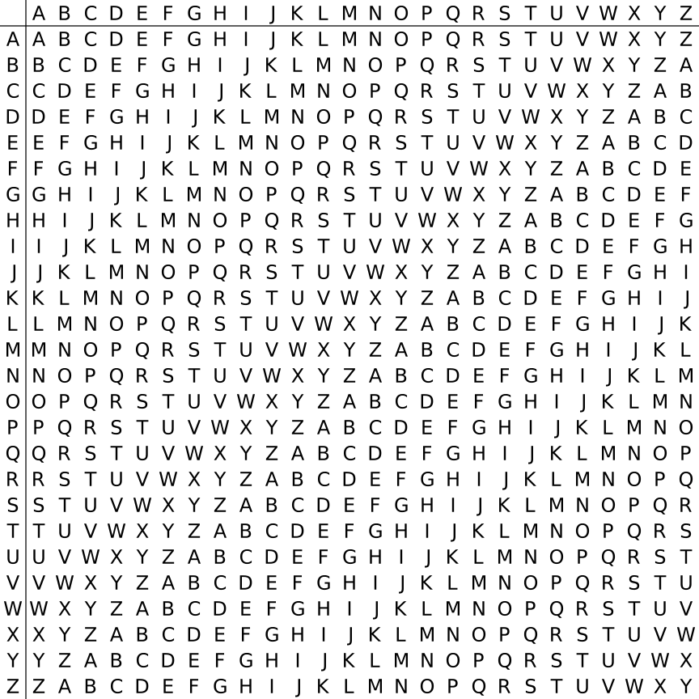

# 多表替换加密

同样的涉及到的此类加密算法也有很多，基本在 Misc 中常见，此处只简单介绍一种加密算法，维吉尼亚密码。

## 维吉尼亚密码

维吉尼亚密码是一种基于凯撒密码的多表替换加密算法。它使用一个密钥来决定每个字母的位移数。

这个加密方法解决了凯撒密码的一个主要问题，即频率分析。由于每个字母的位移数是由密钥决定的，因此频率分析变得更加困难。

以下是使用 crypto 作为密钥的维吉尼亚密码加密的示例

明文：Hello Crypto

密钥：crypto

密文：Jvjah Qtpnih