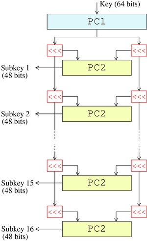
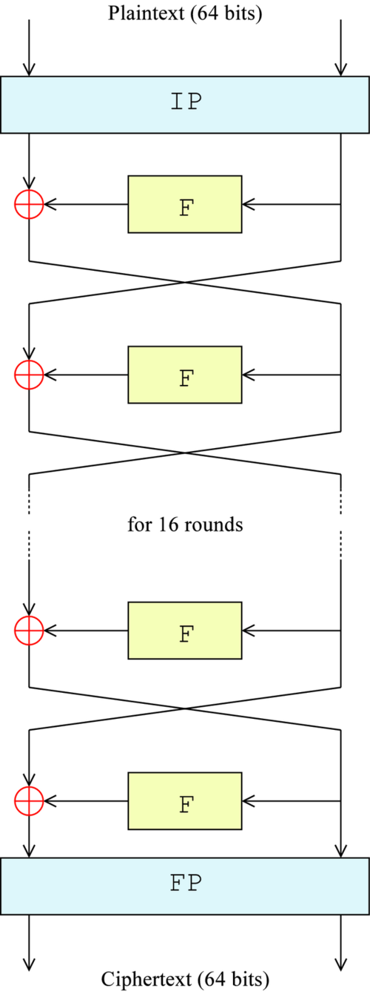

# DES

数据加密标准（Data Encryption Standard）是一种对称密钥加密算法，使用 56 位的密钥对 64 位的明文进行加密。DES 的加密过程包括初始置换、16 轮 Feistel 结构、以及最终置换。

## 原理

**密钥扩展**：由 64 位的密钥扩展为 16 个 48 位的子密钥。实际使用的密钥只有 56 位，剩下的 8 位一般随意设置或可以用作奇偶校验位。



1. PC1 置换：先将 64 位密钥每八位一个字节为一组，按固定表 PC1 进行置换，得到 56 位密钥
2. 16 轮变换：将 56 位密钥分为两部分，左半部分和右半部分各 28 位。每轮变换时，将左半部分和右半部分分别循环左移 1 或 2 位（位数和轮数有关），然后再进行 PC2 置换，得到这一轮输出的 48 位子密钥。最终得到 16 个 48 位的子密钥

如下是密钥扩展的实现

```python
PC1 = [i*8+j for j in [0,1,2] for i in range(7,-1,-1)] + [i*8+3 for i in range(7, 3,-1)] + [i*8+j for j in [6,5,4] for i in range(7,-1,-1)] + [i*8+3 for i in range(3,-1,-1)]

PC2 = [
    13, 16, 10, 23,  0,  4,
     2, 27, 14,  5, 20,  9,
    22, 18, 11,  3, 25,  7,
    15,  6, 26, 19, 12,  1,
    40, 51, 30, 36, 46, 54,
    29, 39, 50, 44, 32, 47,
    43, 48, 38, 55, 33, 52,
    45, 41, 49, 35, 28, 31
]

LEFT_SHIFTS_NUM = [1, 1, 2, 2, 2, 2, 2, 2, 1, 2, 2, 2, 2, 2, 2, 1]

def permutation(block, table):
    return [block[i] for i in table]

def left_shift(block, n):
    return block[n:] + block[:n]

def key_schedule(key):
    key = permutation(key, PC1)
    keys = []
    left, right = key[:28], key[28:]
    for i in range(16):
        left, right = map(lambda x: left_shift(x, LEFT_SHIFTS_NUM[i]), (left, right))
        keys.append(permutation(left+right, PC2))
    return keys
```

**加密**：DES 的加密过程分为初始置换、16 轮 Feistel 结构、以及最终置换。每一轮的 Feistel 结构包括扩展置换、S 盒替换、P 盒置换和异或操作。



因为 DES 是块加密算法，所以加密前通常会对明文进行填充，使其长度为 8 字节（64 位）的整数倍。

1. 初始置换：对明文按照 IP 置换表进行初始置换，得到 64 位的初始数据块
2. 16 轮变换：将初始数据块分为两部分，左半部分和右半部分各 32 位。右半部分不动，直接作为下一轮的左半部分。然后对右半部分进行 E 盒扩展置换，扩展为 48 位，然后和当前轮的子密钥进行异或操作。接下来将异或后的结果分为 8 组，每组 6 位，经过 S 盒替换后得到 4 位 8 组共计 32 位的输出。最后对输出进行 P 盒置换，并和左半部分进行异或操作，作为下一轮的右半部分。重复 16 次，最后将 16 轮变换后的输出左右两部分交换位置，拼接成 64 位的输出
3. 最终置换：对 64 位的输出按照 IP^-1/FP 置换表进行最终置换，得到加密后的密文

完整的 DES 加密算法实现

```python
class DES():
    PC1 = [i*8+j for j in [0,1,2] for i in range(7,-1,-1)] + [i*8+3 for i in range(7, 3,-1)] + [i*8+j for j in [6,5,4] for i in range(7,-1,-1)] + [i*8+3 for i in range(3,-1,-1)]

    PC2 = [
    13, 16, 10, 23,  0,  4,
    2, 27, 14,  5, 20,  9,
    22, 18, 11,  3, 25,  7,
    15,  6, 26, 19, 12,  1,
    40, 51, 30, 36, 46, 54,
    29, 39, 50, 44, 32, 47,
    43, 48, 38, 55, 33, 52,
    45, 41, 49, 35, 28, 31
    ]

    LEFT_SHIFTS_NUM = [1, 1, 2, 2, 2, 2, 2, 2, 1, 2, 2, 2, 2, 2, 2, 1]

    IP = [i*8+j for j in [1, 3, 5, 7, 0, 2, 4, 6] for i in range(7,-1,-1)]

    FP = [i*8+j for j in range(7,-1,-1) for i in [4, 0, 5, 1, 6, 2, 7, 3]]

    E = [(i+j)%32 for j in range(-1, 27+1, 4) for i in range(6)]

    S = [
        [
            [14, 4, 13, 1, 2, 15, 11, 8, 3, 10, 6, 12, 5, 9, 0, 7],
            [0, 15, 7, 4, 14, 2, 13, 1, 10, 6, 12, 11, 9, 5, 3, 8],
            [4, 1, 14, 8, 13, 6, 2, 11, 15, 12, 9, 7, 3, 10, 5, 0],
            [15, 12, 8, 2, 4, 9, 1, 7, 5, 11, 3, 14, 10, 0, 6, 13]
        ],
        [
            [15, 1, 8, 14, 6, 11, 3, 4, 9, 7, 2, 13, 12, 0, 5, 10],
            [3, 13, 4, 7, 15, 2, 8, 14, 12, 0, 1, 10, 6, 9, 11, 5],
            [0, 14, 7, 11, 10, 4, 13, 1, 5, 8, 12, 6, 9, 3, 2, 15],
            [13, 8, 10, 1, 3, 15, 4, 2, 11, 6, 7, 12, 0, 5, 14, 9]
        ],
        [
            [10, 0, 9, 14, 6, 3, 15, 5, 1, 13, 12, 7, 11, 4, 2, 8],
            [13, 7, 0, 9, 3, 4, 6, 10, 2, 8, 5, 14, 12, 11, 15, 1],
            [13, 6, 4, 9, 8, 15, 3, 0, 11, 1, 2, 12, 5, 10, 14, 7],
            [1, 10, 13, 0, 6, 9, 8, 7, 4, 15, 14, 3, 11, 5, 2, 12]
        ],
        [
            [7, 13, 14, 3, 0, 6, 9, 10, 1, 2, 8, 5, 11, 12, 4, 15],
            [13, 8, 11, 5, 6, 15, 0, 3, 4, 7, 2, 12, 1, 10, 14, 9],
            [10, 6, 9, 0, 12, 11, 7, 13, 15, 1, 3, 14, 5, 2, 8, 4],
            [3, 15, 0, 6, 10, 1, 13, 8, 9, 4, 5, 11, 12, 7, 2, 14]
        ],
        [
            [2, 12, 4, 1, 7, 10, 11, 6, 8, 5, 3, 15, 13, 0, 14, 9],
            [14, 11, 2, 12, 4, 7, 13, 1, 5, 0, 15, 10, 3, 9, 8, 6],
            [4, 2, 1, 11, 10, 13, 7, 8, 15, 9, 12, 5, 6, 3, 0, 14],
            [11, 8, 12, 7, 1, 14, 2, 13, 6, 15, 0, 9, 10, 4, 5, 3]
        ],
        [
            [12, 1, 10, 15, 9, 2, 6, 8, 0, 13, 3, 4, 14, 7, 5, 11],
            [10, 15, 4, 2, 7, 12, 9, 5, 6, 1, 13, 14, 0, 11, 3, 8],
            [9, 14, 15, 5, 2, 8, 12, 3, 7, 0, 4, 10, 1, 13, 11, 6],
            [4, 3, 2, 12, 9, 5, 15, 10, 11, 14, 1, 7, 6, 0, 8, 13]
        ],
        [
            [4, 11, 2, 14, 15, 0, 8, 13, 3, 12, 9, 7, 5, 10, 6, 1],
            [13, 0, 11, 7, 4, 9, 1, 10, 14, 3, 5, 12, 2, 15, 8, 6],
            [1, 4, 11, 13, 12, 3, 7, 14, 10, 15, 6, 8, 0, 5, 9, 2],
            [6, 11, 13, 8, 1, 4, 10, 7, 9, 5, 0, 15, 14, 2, 3, 12]
        ],
        [
            [13, 2, 8, 4, 6, 15, 11, 1, 10, 9, 3, 14, 5, 0, 12, 7],
            [1, 15, 13, 8, 10, 3, 7, 4, 12, 5, 6, 11, 0, 14, 9, 2],
            [7, 11, 4, 1, 9, 12, 14, 2, 0, 6, 10, 13, 15, 3, 5, 8],
            [2, 1, 14, 7, 4, 10, 8, 13, 15, 12, 9, 0, 3, 5, 6, 11]
        ]
    ]

    P = [
        15, 6, 19, 20,
        28, 11, 27, 16,
        0, 14, 22, 25,
        4, 17, 30, 9,
        1, 7, 23, 13,
        31, 26, 2, 8,
        18, 12, 29, 5,
        21, 10, 3, 24
    ]

    def __init__(self, key: bytes):
        assert len(key) == 8, ValueError(f"Incorrect DES key length ({len(key)} bytes)")
        self.key = key
        self.keys = self._key_schedule(self.bytes_to_list(key))

    def _xor(self, a, b):
        return [x^y for x, y in zip(a, b)]

    def _permutation(self, block, table):
        return [block[i] for i in table]

    def _left_shift(self, block, n):
        return block[n:] + block[:n]

    def bytes_to_list(self, block):
        return [int(b) for b in ''.join(map(lambda x: bin(x)[2:].zfill(8), block))]

    def list_to_bytes(self, block):
        return bytes([int(''.join(map(str, block[i:i+8])), 2) for i in range(0, len(block), 8)])

    def _key_schedule(self,key):
        key = self._permutation(key, self.PC1)
        keys = []
        left, right = key[:28], key[28:]
        for i in range(16):
            left, right = map(lambda x: self._left_shift(x, self.LEFT_SHIFTS_NUM[i]), (left, right))
            keys.append(self._permutation(left+right, self.PC2))
        return keys

    def _cipher_function(self, block, key):
        block = self._permutation(block, self.E)
        block = self._xor(block, key)
        block = [block[i:i+6] for i in range(0, 48, 6)]
        block = [int(num) for i,b in enumerate(block) for num in bin(self.S[i][b[0]*2+b[-1]][int("".join(map(str,b[1:-1])),2)])[2:].zfill(4)]
        block = self._permutation(block, self.P)
        return block

    def _encrypt(self, block, keys):
        block = self._permutation(block, self.IP)
        left, right = block[:32], block[32:]
        for i in range(16):
            temp = right
            right = self._xor(left, self._cipher_function(right, keys[i]))
            left = temp
        block = right + left
        block = self._permutation(block, self.FP)
        return block

    def _decrypt(self, block):
        return self._encrypt(block, self.keys[::-1])

    def encrypt(self, plaintext: bytes):
        assert len(plaintext) % 8 == 0, ValueError(f"Incorrect DES plaintext length ({len(plaintext)} bytes)")
        ciphertext = b''
        for i in range(0, len(plaintext), 8):
            block = list(plaintext[i:i+8])
            block = self.bytes_to_list(block)
            block = self._encrypt(block, self.keys)
            ciphertext += self.list_to_bytes(block)
        return ciphertext

    def decrypt(self, ciphertext: bytes):
        assert len(ciphertext) % 8 == 0, ValueError(f"Incorrect DES ciphertext length ({len(ciphertext)} bytes)")
        plaintext = b''
        for i in range(0, len(ciphertext), 8):
            block = list(ciphertext[i:i+8])
            block = self.bytes_to_list(block)
            block = self._decrypt(block)
            plaintext += self.list_to_bytes(block)
        return plaintext
```

上述代码仅实现了 DES 的 ECB 模式加密

## TDES

TDES（Triple DES）是对 DES 的一种改进，使用三个 DES 密钥进行三次 DES 加密或解密操作。

通常来说，TDES 是用三个密钥分别对明文进行一次加密，一次解密，再最后一次加密。

## 弱密钥

DES 有一些弱密钥，在加密过程中是严禁使用的。

以下四个是绝对不能使用的弱密钥

```
\x01\x01\x01\x01\x01\x01\x01\x01
\xFE\xFE\xFE\xFE\xFE\xFE\xFE\xFE
\xE0\xE0\xE0\xE0\xF1\xF1\xF1\xF1
\x1F\x1F\x1F\x1F\x0E\x0E\x0E\x0E
```

如果不考虑奇偶校验位的话，那么还有这四个弱密钥

```
\x00\x00\x00\x00\x00\x00\x00\x00
\xFF\xFF\xFF\xFF\xFF\xFF\xFF\xFF
\xE1\xE1\xE1\xE1\xF0\xF0\xF0\xF0
\x1E\x1E\x1E\x1E\x0F\x0F\x0F\x0F
```

还有一些部分弱密钥，是指在密钥扩展的时候只会生成两种子密钥

下面展示了 6 对常见的部分弱密钥对，存在这样的性质$E_{k_1}(E_{k_2}(M))=M$

```
0x011F011F010E010E and 0x1F011F010E010E01
0x01E001E001F101F1 and 0xE001E001F101F101
0x01FE01FE01FE01FE and 0xFE01FE01FE01FE01
0x1FE01FE00EF10EF1 and 0xE01FE01FF10EF10E
0x1FFE1FFE0EFE0EFE and 0xFE1FFE1FFE0EFE0E
0xE0FEE0FEF1FEF1FE and 0xFEE0FEE0FEF1FEF1
```