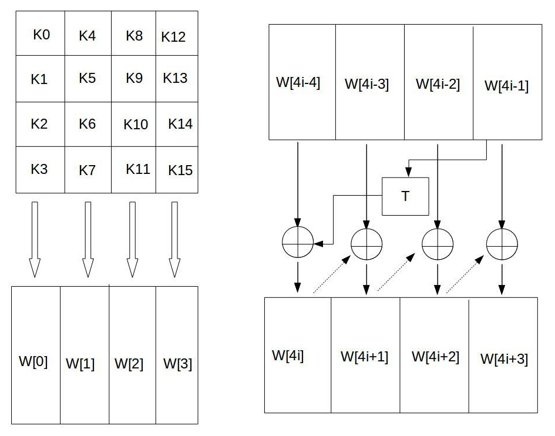
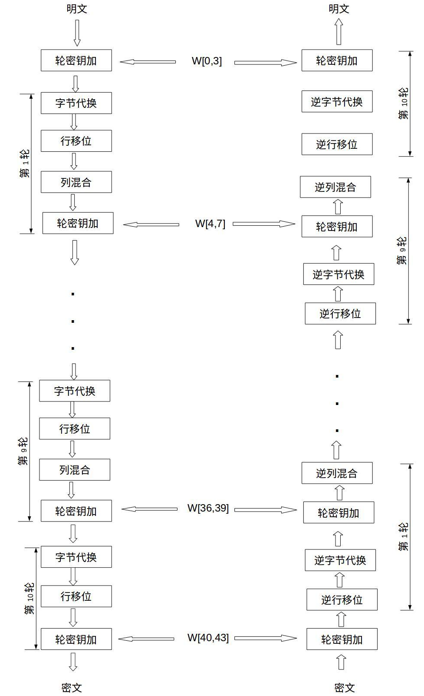
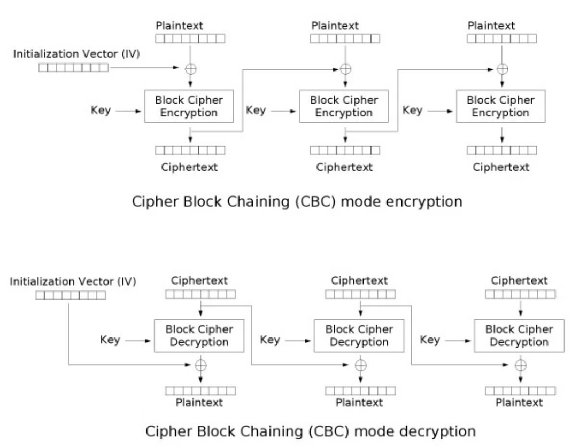
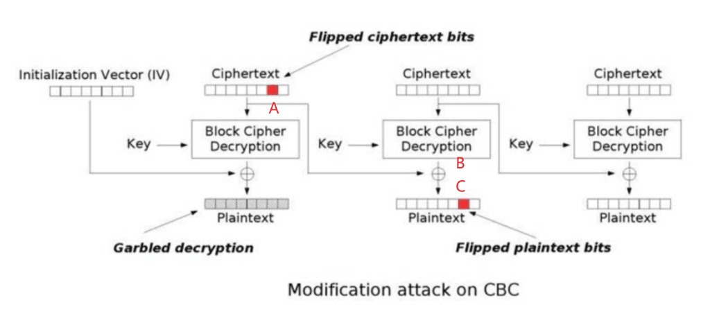

# AES

AES（Advanced Encryption Standard）是一种对称密钥加密算法，使用 128 位的块和 128、192 或 256 位的密钥进行加密。AES 的加密过程包括字节替换、行移位、列混合和轮密钥加。

## 原理

AES 每一块的加密明文大小为 128 位（16 字节）使用密钥长度是 128 位（16 字节）、192 位（24 字节）或 256 位（32 字节）。

不同长度的密钥对应不同的轮数，128 位密钥对应 10 轮，192 位密钥对应 12 轮，256 位密钥对应 14 轮。

以下讨论有关 AES-128 的加解密算法

AES 的加密过程分为初始轮密钥加、10 轮主加密。每一轮的主加密包括字节替换、行移位、列混合和轮密钥加。加解密中把明文块和密钥都写作 4x4 的矩阵，称为状态矩阵。形如下

$$
\left(\begin{matrix}
s_{0} & s_{4} & s_{8} & s_{12} \\
s_{1} & s_{5} & s_{9} & s_{13} \\
s_{2} & s_{6} & s_{10} & s_{14} \\
s_{3} & s_{7} & s_{11} & s_{15}
\end{matrix}\right)
$$

**字节替换**：使用 S 盒对每个字节进行替换。S 盒是一个 16x16 的查找表，将每个字节映射到另一个字节。S 盒的构造是基于有限域$GF(2^8)$的逆元素和仿射变换。

**行移位**：对每一行进行循环左移。第一行不变，第二行左移 1 个字节，第三行左移 2 个字节，第四行左移 3 个字节。

**列混合**：对每一列进行线性变换。每一列的 4 个字节进行矩阵乘法，得到新的 4 个字节。列混合的目的是增加数据的扩散性。

列混合的矩阵乘法，计算如下

$$
\left(\begin{matrix}
s'_{0} & s'_{4} & s'_{8} & s'_{12} \\
s'_{1} & s'_{5} & s'_{9} & s'_{13} \\
s'_{2} & s'_{6} & s'_{10} & s'_{14} \\
s'_{3} & s'_{7} & s'_{11} & s'_{15}
\end{matrix}\right)
=\left(\begin{matrix}
2 & 3 & 1 & 1 \\
1 & 2 & 3 & 1 \\
1 & 1 & 2 & 3 \\
3 & 1 & 1 & 2
\end{matrix}\right)
\left(\begin{matrix}
s_{0} & s_{4} & s_{8} & s_{12} \\
s_{1} & s_{5} & s_{9} & s_{13} \\
s_{2} & s_{6} & s_{10} & s_{14} \\
s_{3} & s_{7} & s_{11} & s_{15}
\end{matrix}\right)
$$

这里要注意的是，AES 中的运算是在有限域$GF(2^8)$上进行的，上文讲解过有关有限域的扩张，这里的加法与乘法运算不是单纯的加减。此外这个有限域选取的不可约多项式是 $x^8+x^4+x^3+x^2+1$

由于该多项式的加法可以看作是在$GF(2)$上进行的，所以加法运算可以直接用异或操作来实现。

而乘法运算则需要使用有限域的乘法规则。要特别的构建该域上的乘法计算

```python
def gmul(a, b):
    p = 0
    while b:
        if b & 1:
            p ^= a
        a = a << 1
        if a >> 8:
            a ^= 0b100011011
        b >>= 1
    return p
```

那么就可以构建在有限域 $GF(2^8)$ 上的矩阵乘法了

```python
def _gmul(a, b):
    p = 0
    while b:
        if b & 1:
            p ^= a
        a = a << 1
        if a >> 8:
            a ^= 0b100011011
        b >>= 1
    return p

def _xor(a):
    return a[0] ^ _xor(a[1:]) if len(a) > 1 else a[0]

def _multiply(a, b):
    return _xor([_gmul(x, y) for x, y in zip(a, b)])

def _matrix_multiply(const, state):
    return [[_multiply(const[i], [state[k][j] for k in range(4)]) for j in range(4)] for i in range(4)]
```

**轮密钥加**：将当前状态矩阵与轮密钥进行异或操作。轮密钥是由密钥扩展算法生成的，每一轮使用不同的轮密钥。

**密钥扩展**：将 16 字节的密钥，每四个一组进行扩展，输出 11 个 16 字节的轮密钥。扩展算法如下图



然后我们来关注一下 T 函数的操作，先将一组 4 字节的密钥进行循环左移一个字节，然后对每个字节进行 S 盒替换，最后将第一个字节和 Rcon[i] 常量进行异或操作。用于增加密钥的扩散性。

那么按照整个加密算法的流程图就能实现 AES 的加密算法了



同样的解密算法只需要将加密算法中的操作顺序逆向即可。

**轮密钥加**，**逆行移位**，**逆字节替换**，这些都很好逆向。我们重点来关注一下**逆列混合**的实现

前面有提到过列混合的计算是在有限域$GF(2^8)$上进行的，那么我们可以计算出列混合所用的系数矩阵的逆矩阵如下

$$
\left(\begin{matrix}
14 & 11 & 13 & 9 \\
9 & 14 & 11 & 13 \\
13 & 9 & 14 & 11 \\
11 & 13 & 9 & 14
\end{matrix}\right)
\left(\begin{matrix}
2 & 3 & 1 & 1 \\
1 & 2 & 3 & 1 \\
1 & 1 & 2 & 3 \\
3 & 1 & 1 & 2
\end{matrix}\right)
=\left(\begin{matrix}
1 & 0 & 0 & 0 \\
0 & 1 & 0 & 0 \\
0 & 0 & 1 & 0 \\
0 & 0 & 0 & 1
\end{matrix}\right)
$$

用之前构建的矩阵乘法来检验一下

```python
In[1]:  def _left_shift(block, n):
            return block[n:] + block[:n]

        print(_matrix_multiply([_left_shift([2,3,1,1], 4-i) for i in range(4)], [_left_shift([0xe,0xb,0xd,0x9], 4-i) for i in range(4)]))

Out[1]: [
            [1,0,0,0],
            [0,1,0,0],
            [0,0,1,0],
            [0,0,0,1]
        ]
```

最终能搓出来这样的代码实现

```python
class AES():
    Rcon = [0x01, 0x02, 0x04, 0x08, 0x10, 0x20, 0x40, 0x80, 0x1B, 0x36]

    def __init__(self, key: bytes, rounds: int = 10):
        self.rounds = rounds
        self.key = key
        self.S = self._generate_sbox()
        self.S_inv = self._generate_sinvbox()
        self.W = [list(key[i:i+4]) for i in range(0,16,4)]
        self._key_expansion()

    def _xor(self, a, b=None):
        if b is None:
            assert len(a) > 0
            return a[0] ^ self._xor(a[1:]) if len(a) > 1 else a[0]
        assert len(a) == len(b)
        return [x^y for x, y in zip(a, b)]

    def _gmul(self, a, b):
        p = 0
        while b:
            if b & 1:
                p ^= a
            a = a << 1
            if a >> 8:
                a ^= 0b100011011
            b >>= 1
        return p

    def _multiply(self, a, b):
        return self._xor([self._gmul(x, y) for x, y in zip(a, b)])

    def _matrix_multiply(self, const, state):
        return [[self._multiply(const[i], [state[k][j] for k in range(4)]) for j in range(4)] for i in range(4)]

    def _permutation(self, lis, table):
        return [table[i] for i in lis]

    def _block_permutation(self, block, table):
        return [self._permutation(row, table) for row in block]

    def _left_shift(self, block, n):
        return block[n:] + block[:n]

    def _bytes_to_matrix(self, text: bytes) -> list[list[int]]:
        return [[text[j*4+i] for j in range(4)] for i in range(4)]

    def _matrix_to_bytes(self, block: list[list[int]]) -> bytes:
        return bytes([block[j][i] for i in range(4) for j in range(4)])

    def _T(self, w: list[int], n) -> list[int]:
        w = self._left_shift(w, 1)
        w = self._permutation(w, self.S)
        w[0] ^= self.Rcon[n]
        return w

    def _generate_sbox(self):
        S = [0x63]+[0]*255
        r = lambda x,s:(x<<s|x>>8-s)%256
        p, q = 1, 1
        for _ in range(255):
            p = (p^(p*2)^[27,0][p<128])%256
            q ^= q*2
            q ^= q*4
            q ^= q*16
            q &= 255
            q ^= [9,0][q<128]
            S[p] = q^r(q,1)^r(q,2)^r(q,3)^r(q,4)^99
        return S

    def _generate_sinvbox(self):
        S_inv = [0]*256
        for i in range(256):
            S_inv[self.S[i]] = i
        return S_inv

    def _key_expansion(self):
        for i in range(4,(self.rounds+1)*4):
            if i % 4 == 0:
                self.W.append(self._xor(self.W[i-4], self._T(self.W[i-1], i//4-1)))
            else:
                self.W.append(self._xor(self.W[i-4], self.W[i-1]))

    def _row_shift(self, block: list[list[int]]) -> list[list[int]]:
        return [self._left_shift(block[i], i) for i in range(4)]

    def _column_mix(self, block: list[list[int]]) -> list[list[int]]:
        return self._matrix_multiply([self._left_shift([2,3,1,1],4-i) for i in range(4)], block)

    def _round_key_add(self, block: list[list[int]], key: list[list[int]]) -> list[list[int]]:
        return [self._xor(block[i],[key[j][i] for j in range(4)]) for i in range(4)]

    def _encrypt(self, block: list[list[int]]) -> list[list[int]]:
        block = self._round_key_add(block, self.W[:4])
        for i in range(1,self.rounds):
            block = self._block_permutation(block, self.S)
            block = self._row_shift(block)
            block = self._column_mix(block)
            block = self._round_key_add(block, self.W[i*4:(i+1)*4])
        block = self._block_permutation(block, self.S)
        block = self._row_shift(block)
        block = self._round_key_add(block, self.W[-4:])
        return block

    def _inv_row_shift(self, block: list[list[int]]) -> list[list[int]]:
        return [self._left_shift(block[i], 4-i) for i in range(4)]

    def _inv_column_mix(self, block: list[list[int]]) -> list[list[int]]:
        return self._matrix_multiply([self._left_shift([14,11,13,0x9], 4-i)for i in range(4)], block)

    def _decrypt(self, block: list[list[int]]) -> list[list[int]]:
        block = self._round_key_add(block, self.W[-4:])
        for i in range(self.rounds-1, 0, -1):
            block = self._inv_row_shift(block)
            block = self._block_permutation(block, self.S_inv)
            block = self._round_key_add(block, self.W[i*4:(i+1)*4])
            block = self._inv_column_mix(block)
        block = self._inv_row_shift(block)
        block = self._block_permutation(block, self.S_inv)
        block = self._round_key_add(block, self.W[:4])
        return block

    def encrypt(self, plaintext: bytes) -> bytes:
        assert len(plaintext) % 16 == 0, ValueError(f"Incorrect AES plaintext length ({len(plaintext)} bytes)")
        ciphertext = b''
        for i in range(0, len(plaintext), 16):
            block = plaintext[i:i+16]
            block = self._bytes_to_matrix(block)
            block = self._encrypt(block)
            ciphertext += self._matrix_to_bytes(block)
        return ciphertext

    def decrypt(self, ciphertext: bytes) -> bytes:
        assert len(ciphertext) % 16 == 0, ValueError(f"Incorrect AES ciphertext length ({len(ciphertext)} bytes)")
        plaintext = b''
        for i in range(0, len(ciphertext), 16):
            block = ciphertext[i:i+16]
            block = self._bytes_to_matrix(block)
            block = self._decrypt(block)
            plaintext += self._matrix_to_bytes(block)
        return plaintext
```

## 字节反转攻击

此攻击针对的是 CBC 模式的块加密，并非针对 AES 的加密原理进行攻击



上图是 CBC 模式的加密原理，加密时除了要有明文，密钥之外还需要有一个初始向量 IV，用来对第一个明文块进行异或

此类问题一般是能够向靶机发送明文的请求，并且能够接收返回的密文

那么我们就能通过特定该构造密文，使得发送给靶机经过解密后的明文达到我们预期的伪造结果



由于 C=B⊕A，可以特定改变 A，使 C 变成想要的指定字符 C'，那么有 C'=B⊕A'

推导得 A’=A⊕C⊕C'

但要注意的是，虽然 C 被指定改变，但 A 的改变会影响到整段第一明文的变化

## Padding Oracle Attack

Padding Oracle Attack 是一种针对使用填充的对称加密算法的攻击方法，尤其是 CBC 模式下的 AES 加密。它利用了填充验证错误的信息泄露来逐步破解加密的消息。

因为 AES 加密要求明文长度必须是 16 的倍数，所以需要对明文进行填充。常见的填充方式有 PKCS#7 填充。

**PKCS#7**填充的规则是，如果明文长度不足 16 字节，则在末尾添加 N 个字节，每个字节的值都为 N，不能不填充。例如(这里假设块长度为 8 字节)

1234 → 1234\0x04\0x04\0x04\0x04

12345678 → 12345678\0x08\0x08\0x08\0x08\0x08\0x08\0x08\0x08

此类情况下你能获得一段密文和一个可以解密任何密文的靶机，靶机会尝试去掉明文填充，若填充错误则会有错误信息返回，若填充正确则会返回正确的明文

由于 Ciphertext i 在经过 key 解密后要和 Ciphertext i-1 异或得到 Plaintxt i

于是可以尝试对 Ciphertext i 的特定字节修改，来改变 Ciphertext i-1 的解密结果的特定字节。

那么只有当最后一个字节符合填充规则时，靶机才能返回正确的输出。于是就能根据\0x01 和修改的字节计算出加密后的正确字节，再依据修改前的字节，得到正确的明文字节。

那么依次类推，依次爆破块中的每一个字节，直到整个块都被破解出来

**[查看例题](./challenges/2.AES/Padding%20Orcal%20Attack/task.py)**

## Square Attack

积分攻击（_Square Attack_）对于低轮数的 AES 加密中可以起到有效作用。

施工中...

攻击脚本

```python
class AES():
    # AES implementation as above
    pass

def test_set(get_enc):
    """
    test after 3 rounds changes, whether all the 256 states are xor to 0
    """
    m_add = 0x01000000000000000000000000000000
    c3_set = []
    for i in range(0x100):
        c3 = get_enc(hex(i * m_add)[2:].zfill(32))
        c3_set.append(c3)

    t = 0
    x, y = 2, 3
    for i in range(0x100):
        t ^= c3_set[i][x + y * 4]
    print(t)


Sbox = (
    0x63, 0x7c, 0x77, 0x7b, 0xf2, 0x6b, 0x6f, 0xc5, 0x30, 0x01, 0x67, 0x2b, 0xfe, 0xd7, 0xab, 0x76,
    0xca, 0x82, 0xc9, 0x7d, 0xfa, 0x59, 0x47, 0xf0, 0xad, 0xd4, 0xa2, 0xaf, 0x9c, 0xa4, 0x72, 0xc0,
    0xb7, 0xfd, 0x93, 0x26, 0x36, 0x3f, 0xf7, 0xcc, 0x34, 0xa5, 0xe5, 0xf1, 0x71, 0xd8, 0x31, 0x15,
    0x04, 0xc7, 0x23, 0xc3, 0x18, 0x96, 0x05, 0x9a, 0x07, 0x12, 0x80, 0xe2, 0xeb, 0x27, 0xb2, 0x75,
    0x09, 0x83, 0x2c, 0x1a, 0x1b, 0x6e, 0x5a, 0xa0, 0x52, 0x3b, 0xd6, 0xb3, 0x29, 0xe3, 0x2f, 0x84,
    0x53, 0xd1, 0x00, 0xed, 0x20, 0xfc, 0xb1, 0x5b, 0x6a, 0xcb, 0xbe, 0x39, 0x4a, 0x4c, 0x58, 0xcf,
    0xd0, 0xef, 0xaa, 0xfb, 0x43, 0x4d, 0x33, 0x85, 0x45, 0xf9, 0x02, 0x7f, 0x50, 0x3c, 0x9f, 0xa8,
    0x51, 0xa3, 0x40, 0x8f, 0x92, 0x9d, 0x38, 0xf5, 0xbc, 0xb6, 0xda, 0x21, 0x10, 0xff, 0xf3, 0xd2,
    0xcd, 0x0c, 0x13, 0xec, 0x5f, 0x97, 0x44, 0x17, 0xc4, 0xa7, 0x7e, 0x3d, 0x64, 0x5d, 0x19, 0x73,
    0x60, 0x81, 0x4f, 0xdc, 0x22, 0x2a, 0x90, 0x88, 0x46, 0xee, 0xb8, 0x14, 0xde, 0x5e, 0x0b, 0xdb,
    0xe0, 0x32, 0x3a, 0x0a, 0x49, 0x06, 0x24, 0x5c, 0xc2, 0xd3, 0xac, 0x62, 0x91, 0x95, 0xe4, 0x79,
    0xe7, 0xc8, 0x37, 0x6d, 0x8d, 0xd5, 0x4e, 0xa9, 0x6c, 0x56, 0xf4, 0xea, 0x65, 0x7a, 0xae, 0x08,
    0xba, 0x78, 0x25, 0x2e, 0x1c, 0xa6, 0xb4, 0xc6, 0xe8, 0xdd, 0x74, 0x1f, 0x4b, 0xbd, 0x8b, 0x8a,
    0x70, 0x3e, 0xb5, 0x66, 0x48, 0x03, 0xf6, 0x0e, 0x61, 0x35, 0x57, 0xb9, 0x86, 0xc1, 0x1d, 0x9e,
    0xe1, 0xf8, 0x98, 0x11, 0x69, 0xd9, 0x8e, 0x94, 0x9b, 0x1e, 0x87, 0xe9, 0xce, 0x55, 0x28, 0xdf,
    0x8c, 0xa1, 0x89, 0x0d, 0xbf, 0xe6, 0x42, 0x68, 0x41, 0x99, 0x2d, 0x0f, 0xb0, 0x54, 0xbb, 0x16
)

InvSbox = (
    0x52, 0x09, 0x6A, 0xD5, 0x30, 0x36, 0xA5, 0x38, 0xBF, 0x40, 0xA3, 0x9E, 0x81, 0xF3, 0xD7, 0xFB,
    0x7C, 0xE3, 0x39, 0x82, 0x9B, 0x2F, 0xFF, 0x87, 0x34, 0x8E, 0x43, 0x44, 0xC4, 0xDE, 0xE9, 0xCB,
    0x54, 0x7B, 0x94, 0x32, 0xA6, 0xC2, 0x23, 0x3D, 0xEE, 0x4C, 0x95, 0x0B, 0x42, 0xFA, 0xC3, 0x4E,
    0x08, 0x2E, 0xA1, 0x66, 0x28, 0xD9, 0x24, 0xB2, 0x76, 0x5B, 0xA2, 0x49, 0x6D, 0x8B, 0xD1, 0x25,
    0x72, 0xF8, 0xF6, 0x64, 0x86, 0x68, 0x98, 0x16, 0xD4, 0xA4, 0x5C, 0xCC, 0x5D, 0x65, 0xB6, 0x92,
    0x6C, 0x70, 0x48, 0x50, 0xFD, 0xED, 0xB9, 0xDA, 0x5E, 0x15, 0x46, 0x57, 0xA7, 0x8D, 0x9D, 0x84,
    0x90, 0xD8, 0xAB, 0x00, 0x8C, 0xBC, 0xD3, 0x0A, 0xF7, 0xE4, 0x58, 0x05, 0xB8, 0xB3, 0x45, 0x06,
    0xD0, 0x2C, 0x1E, 0x8F, 0xCA, 0x3F, 0x0F, 0x02, 0xC1, 0xAF, 0xBD, 0x03, 0x01, 0x13, 0x8A, 0x6B,
    0x3A, 0x91, 0x11, 0x41, 0x4F, 0x67, 0xDC, 0xEA, 0x97, 0xF2, 0xCF, 0xCE, 0xF0, 0xB4, 0xE6, 0x73,
    0x96, 0xAC, 0x74, 0x22, 0xE7, 0xAD, 0x35, 0x85, 0xE2, 0xF9, 0x37, 0xE8, 0x1C, 0x75, 0xDF, 0x6E,
    0x47, 0xF1, 0x1A, 0x71, 0x1D, 0x29, 0xC5, 0x89, 0x6F, 0xB7, 0x62, 0x0E, 0xAA, 0x18, 0xBE, 0x1B,
    0xFC, 0x56, 0x3E, 0x4B, 0xC6, 0xD2, 0x79, 0x20, 0x9A, 0xDB, 0xC0, 0xFE, 0x78, 0xCD, 0x5A, 0xF4,
    0x1F, 0xDD, 0xA8, 0x33, 0x88, 0x07, 0xC7, 0x31, 0xB1, 0x12, 0x10, 0x59, 0x27, 0x80, 0xEC, 0x5F,
    0x60, 0x51, 0x7F, 0xA9, 0x19, 0xB5, 0x4A, 0x0D, 0x2D, 0xE5, 0x7A, 0x9F, 0x93, 0xC9, 0x9C, 0xEF,
    0xA0, 0xE0, 0x3B, 0x4D, 0xAE, 0x2A, 0xF5, 0xB0, 0xC8, 0xEB, 0xBB, 0x3C, 0x83, 0x53, 0x99, 0x61,
    0x17, 0x2B, 0x04, 0x7E, 0xBA, 0x77, 0xD6, 0x26, 0xE1, 0x69, 0x14, 0x63, 0x55, 0x21, 0x0C, 0x7D,
)

Rcon = (
    0x01, 0x02, 0x04, 0x08, 0x10, 0x20, 0x40, 0x80, 0x1b, 0x36
)


def inv_shift_rows(s):
    a = list(s)
    a[1], a[5], a[9], a[13] = a[13], a[1], a[5], a[9]
    a[2], a[6], a[10], a[14] = a[10], a[14], a[2], a[6]
    a[3], a[7], a[11], a[15] = a[7], a[11], a[15], a[3]
    return bytes(a)


def inv_sub_bytes(s):
    return bytes(InvSbox[x] for x in s)


def xor(a, b):
    return bytes([x ^ y for x, y in zip(a, b)])


c4_set = []


def get_round_key_4(get_enc):
    global c4_set
    predict_round_key_4 = [[] for _ in range(16)]
    print("--------------guess--------------")
    m = 1 << (15 * 8)

    for i in range(0x100):
        c4 = get_enc(hex(i * m)[2:].zfill(32))
        c4_set.append(c4)

    for key_index in range(16):
        for key in range(0x100):
            round_key = [0 for _ in range(16)]
            round_key[key_index] = key
            round_key = bytes(round_key)
            c3_set = []
            for c4 in c4_set:
                c3 = xor(c4, round_key)
                c3 = inv_shift_rows(c3)
                c3 = inv_sub_bytes(c3)
                c3_set.append(c3)
            t = 0
            for i in range(0x100):
                t ^= c3_set[i][(key_index + 4 * (key_index % 4)) % 16]
            if t == 0:
                predict_round_key_4[key_index] += [key]
                print(f"key index: {key_index:2d}, probable key: {hex(key)}")

    return predict_round_key_4


def key_from_round_key(key_list, n=4):
    round_keys = [[] for _ in range(n + 1)]
    round_keys[-1] = key_list
    for i in range(n - 1, -1, -1):
        new_key = [0 for _ in range(16)]
        for j in range(3, 0, -1):
            new_key[j * 4:(j + 1) * 4] = [x ^ y for x, y in zip(round_keys[i + 1][j * 4:(j + 1) * 4], round_keys[i + 1][(j - 1) * 4:j * 4])]
        tmp = new_key[-4:]
        tmp = tmp[1:] + tmp[:1]
        tmp = bytes([Sbox[b] for b in tmp])
        tmp = bytes([tmp[0] ^ Rcon[i]]) + tmp[1:]
        new_key[:4] = [x ^ y for x, y in zip(round_keys[i + 1][:4], tmp)]
        round_keys[i] = new_key

    return bytes(round_keys[0])


def square_attack(get_enc):
    from itertools import product
    round_key_4 = get_round_key_4(get_enc)
    for i in product(*round_key_4):
        key = key_from_round_key(bytes(i))
        aes = AES(key, 4)
        for j in range(0x100):
            m = 1 << (15 * 8)
            if aes.encrypt(bytes.fromhex(hex(j * m)[2:].zfill(32))) != c4_set[j]:
                break
        else:
            print("[+] key found")
            break
    return key


if __name__ == "__main__":
    """
    这个脚本交互256次，然后通过检验密文来从可能keys中确定key
    """
    import os

    key = os.urandom(16)
    aes = AES(key, 4)
    get_enc = lambda x: aes.encrypt(bytes.fromhex(x))

    # AES square attack
    key_ = square_attack(lambda x: aes.encrypt(bytes.fromhex(x)))
    print(key.hex())
    print(key_.hex())

    # # test AES square attack correctness
    # key = os.urandom(16)
    # aes = AES(key, 3)
    # test_set(get_enc)

```

## Differential Cryptanalysis

差分攻击（_Differential Cryptanalysis_）对于标准 AES 算法无效，主要取决于 AES 的 S 盒使得最大差分概率为 $\frac{4}{256}$，造成在多轮加密下差分路径无法走通。同时列混合会对差分结果产生扩散作用，使得统计上的高概率差分结果不存在。

差分是指明文对之间的差异，在经过 S 盒变换后，会造成输出具有统计上的高概率差异。同时在加密过程中通常会伴随着**轮密钥加**的操作，而轮密钥加不会影响输入输出对的异或差异，因此，在简化情况下只考虑 S 盒变换和轮密钥加，可以通过统计意义上的高概率差分路径来进行攻击。

此处先简记为 S[m⊕K0]⊕K1，表示一轮操作；Δ 表示差分

对于一轮操作 S[m⊕K0]⊕K1，可以发现，如果对 K1 进行遍历，然后计算 Δm = ΔS_inv[c⊕K1]，只要判断是否和构造的明文差分相等，就能统计出每个 K1 导致的输出差分出现的次数，从而找到最可能的 K1 值。

但是对于两轮的 S[S[m⊕K0]⊕K1]⊕K2，我们会发现，上述方法用不了了。

对于一个 4bit 的 S 盒 `[0x0, 0xE, 0x4, 0xD, 0x7, 0x1, 0xA, 0xF, 0x2, 0xC, 0xB, 0x9, 0x5, 0x3, 0x8, 0x6]`，可以用脚本计算出得到如下的差分分布表

```text
I\O 00 01 02 03 04 05 06 07 08 09 0A 0B 0C 0D 0E 0F
00  16  0  0  0  0  0  0  0  0  0  0  0  0  0  0  0
01   0  0  2  0  0  2  4  0  0  2  0  0  0  0  6  0
02   0  0  0  2  2  4  0  0  0  2  0  0  0  4  2  0
03   0  0  0  2  0  0  0  2  2  0  2  6  0  2  0  0
04   0  0  2  2  0  0  0  4  0  0  0  0  0  0  2  6
05   0  6  0  0  0  0  0  2  0  4  0  2  0  2  0  0
06   0  2  0  2  0  0  0  0  0  0  8  0  2  0  2  0
07   0  0  0  0  6  2  0  0  2  0  2  0  2  0  0  2
08   0  0 10  0  2  0  0  0  0  2  0  0  0  0  0  2
09   0  0  0  0  4  0  2  2  0  0  0  0  6  2  0  0
0A   0  2  0  0  0  0  2  4  0  0  0  2  2  0  0  4
0B   0  2  0  0  0  2  0  0  2  6  2  0  0  0  0  2
0C   0  2  0  0  0  4  2  0  0  0  0  2  2  4  0  0
0D   0  0  2  6  2  2  0  0  0  0  0  4  0  0  0  0
0E   0  2  0  2  0  0  0  0  8  0  0  0  2  0  2  0
0F   0  0  0  0  0  0  6  2  2  0  2  0  0  2  2  0
```

纵坐标表示输入差分，横坐标表示输出差分，表中值表示在对应输入输出差分下的出现次数。例如输入差分为 0x01，输出差分为 0x0E 时，出现了 6 次。

很显然能发现有一个 0x08->0x02 最大差分概率为 10/16=0.625，可以将其做为我们选定的差分路径

所以我们可以先构造大量的输入差分为 0x08 的明文对，我们可以知道在经过第一次操作之后输出差分大概率为 0x02，但是我们能得到的是经过两次操作的密文对，所以可以针对第二轮的 K2 进行遍历，然后计算 Δm2 = ΔS_inv[c2⊕K2]，只要判断是否和 0x02 相等，就能统计出每个 K2 导致的输出差分出现的次数，从而找到最可能的 K2 值。

同时，因为预期一轮操作之后的输出差分是 0x02，所以第二轮操作之后预期的输出差分也是可以判断的，是落在 `[0x03, 0x04, 0x05, 0x09, 0x0D, 0x0E]` 之间的，所以我们还可以额外对密文对进行一次去噪，用来提高期望差分出现的概率。

