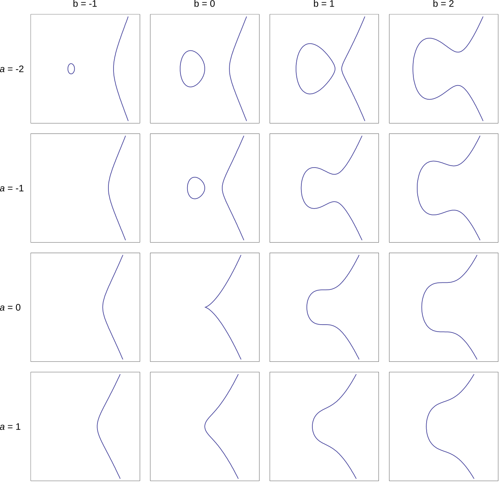
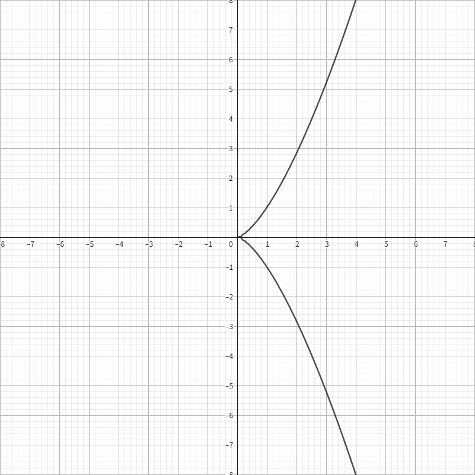
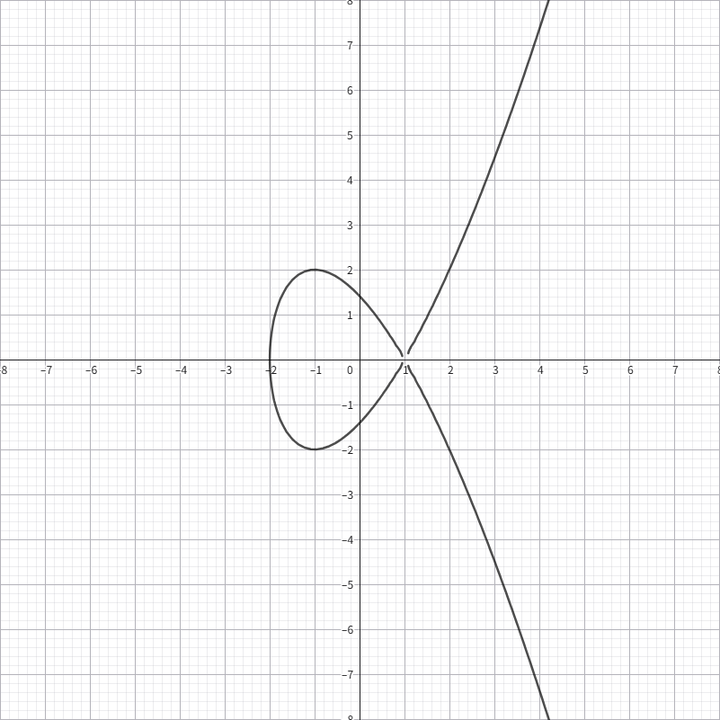

# ECC

椭圆曲线密码学（ECC）是一种基于椭圆曲线数学结构的公钥密码学方法。ECC 的安全性基于椭圆曲线离散对数问题（ECDLP）

## 椭圆曲线

椭圆曲线通常是一个在平面上由关于 $x$ 和 $y$ 的方程定义的曲线，形式通常为

$$
y^2 = x^3 + ax + b
$$



这样形式的曲线，也通常称为 Weierstrass 曲线。

当这个方程表示的曲线是一条连续的曲线时，当且仅当判别式

$$
\Delta=-16(4a^3+27b^2)\ne 0
$$

为了能符合密码学的使用，需要对其变换使得能够在有限群上进行运算，先选出大素数$p$，然后可以定义出在椭圆曲线上的点的加法运算。先定义 0 点为椭圆曲线上的无穷远点，记作 $\mathcal{O}$。对于两个点 $P$ 和 $Q$，可以通过以下步骤计算它们的和 $R = P + Q$：

1. 连接 $P$ 和 $Q$ 的直线，找到与椭圆曲线的交点。
2. 该直线与椭圆曲线的第三个交点 $R'$。
3. 将 $R'$ 关于 $x$ 轴对称得到点 $R$ 即为 $P + Q$ 的结果。

此外，推广一下能得到当$P=Q$时，两点的连线即为切线。以及$-P=(P_x,-P_y)$

那么根据加法运算的定义，可以推导出加法的计算方法

$$
K = \frac{y_P-y_Q}{x_P-x_Q}
$$

$$
R = P + Q = (K^2 - x_P - x_Q, - y_P + K(x_P - x_R))
$$

当$P=Q$时

$$
K = \frac{3x_P^2 + a}{2y_P}
$$

有了加法，就能很简单的推出乘法的计算了。但如果普通的不断加法计算乘法的话，时间复杂度是 $O(n)$ 的。于是可以利用二进制来计算乘法，这样时间复杂度就能降到 $O(\log n)$

例如，计算 $(101001)_2\cdot P$ 的时候可以计算出 $2^5\cdot P$，$2^3\cdot P$和$2^0\cdot P$ 然后相加就是要计算的乘法结果。

相似的，对于这个椭圆曲线有限群，一样存在生成元，也称为基点，记作 $G$。也存在群阶，记作 $n$。

## 原理

明白椭圆曲线的一些基本概念之后，就可以开始探究 ECC 的原理了

1. 首先选定一个椭圆曲线 $E$ 和一个基点 $G$，假设这个椭圆曲线的群阶为 $n$。
2. 选择一个私钥 $d$，计算出公钥 $P = dG$。
3. 公开曲线 $E$、$G$、$p$，以及公钥 $P$
4. **加密**：选取一个随机数 $k$，计算出 $Q = kG$ 和 $C = M + kP$，得到加密结果$(Q,C)$。
5. **解密**：接收方使用私钥 $a$ 计算 $M = C - dQ$，得到明文 $M$。

ECC 的安全性基于椭圆曲线离散对数问题（ECDLP），即给定 $P$ 和 $Q$，计算出 $d$ 使得 $Q = dP$ 是一个困难的问题。

但是还是不乏有一些对于较小数情况下的 ECDLP 算法，在前文 DLP 中讲解了常见的三种 DLP 算法

## ECDH

ECDH 是 Diffie-Hellman 密钥交换算法在椭圆曲线上的实现。其原理与 DH 密钥交换算法类似。

1. Alice 和 Bob 选择一个椭圆曲线 $E$ 和一个基点 $G$。
2. Alice 选择一个私钥 $a$，计算出公钥 $A = aG$，并将 $A$ 发送给 Bob。
3. Bob 选择一个私钥 $b$，计算出公钥 $B = bG$，并将 $B$ 发送给 Alice。
4. Alice 接收到 Bob 的公钥后，计算出共享密钥 $K_A = bA$。
5. Bob 接收到 Alice 的公钥后，计算出共享密钥 $K_B = aB$。
6. 最终，Alice 和 Bob 都得到了相同的共享密钥 $K = abG$。

## Smart's Attack

<sup><a href="#references1">[1]</a></sup> 条件：$E.order()=p$

在这个条件下可以解决 ECDLP 问题。

~~网上搜了搜关于 Smart's Attack 的内容，遗憾的是几乎所有的博客都只贴上了这样的板子，并没有一篇文章详细阐述了攻击原理，所以这里只能暂时搁置了~~

```python
def SmartAttack(P,Q,p):
    E = P.curve()
    Eqp = EllipticCurve(Qp(p, 2), [ ZZ(t) + randint(0,p)*p for t in E.a_invariants() ])

    P_Qps = Eqp.lift_x(ZZ(P.xy()[0]), all=True)
    for P_Qp in P_Qps:
        if GF(p)(P_Qp.xy()[1]) == P.xy()[1]:
            break

    Q_Qps = Eqp.lift_x(ZZ(Q.xy()[0]), all=True)
    for Q_Qp in Q_Qps:
        if GF(p)(Q_Qp.xy()[1]) == Q.xy()[1]:
            break

    p_times_P = p*P_Qp
    p_times_Q = p*Q_Qp

    x_P,y_P = p_times_P.xy()
    x_Q,y_Q = p_times_Q.xy()

    phi_P = -(x_P/y_P)
    phi_Q = -(x_Q/y_Q)
    k = phi_Q/phi_P
    return ZZ(k)
```

**[查看例题](./challenges/3.ECC/smart's%20attack/task.sage)**

> **参考文献**： <a id="references1" href="https://link.springer.com/article/10.1007/s001459900052">[1]</a> Smart N P. The discrete logarithm problem on elliptic curves of trace one[J]. Journal of cryptology, 1999, 12: 193-196.

## MOV attack

<sup><a href="#references2">[2]</a></sup> 条件：$E.order()=p+1$

使用双线性配对，使得原 ECDLP 问题变为了 DLP 问题，最重要的意义在于实质证明了 ECDLP 问题与 DLP 问题是等价的。

```python
a =
b =
p =
Fp = GF(p)
E = EllipticCurve(Fp, [a, b])
G = E(, )
P = E(, )

order = E.order()
k = 1
while (p**k - 1) % order:
    k += 1

K.<a> = Fp.extension(k)
EK = E.base_extend(K)
PK = EK(P)
GK = EK(G)
QK = EK.lift_x(a + 3)  # Independent from PK
AA = PK.tate_pairing(QK, E.order(), k)
GG = GK.tate_pairing(QK, E.order(), k)
r = AA.log(GG)
print(r)
```

> **参考文献**： <a id="references2" href="https://ieeexplore.ieee.org/document/259647">[2]</a> Menezes A, Vanstone S, Okamoto T. Reducing elliptic curve logarithms to logarithms in a finite field[C] Proceedings of the twenty-third annual ACM symposium on Theory of computing. 1991: 80-89.

## Invalid curve attack

无效曲线攻击（Invalid Curve Attack）是一种针对椭圆曲线密码学（ECC）的攻击方法，主要利用了靶机在对于传入的点没有验证其正确性，造成的安全性漏洞。

这个攻击通常发生在 ECDH 密钥交换过程中，攻击者可以通过发送一个无效的椭圆曲线点来破坏密钥交换的安全性。

基于 ECDH，我们可以知道，当我们向靶机发送一个点的时候，靶机会计算这个点和私钥的乘积并返回计算结果。

假如当我们选取了一个无效的点 $P$，并且根据椭圆曲线上的加法定义可以显然得到在计算乘法的时候完全和 $b$ 的取值无关，因此返回的点一定是在该无效曲线上的

于是可以尝试构造出一个带有小阶的无效点 $P$，然后通过计算 $kP$ 的方式来得到点 $Q$，那么就能很容易得到 $k' = k \mod P.order()$

当有足够数量的同余式后，用 CRT 合并即可得到靶机的私钥

**[查看例题](./challenges/3.ECC/invalid%20curve%20attack/task.py)**

## 双线性配对

### 除子

在代数几何中，对于一个曲线 $E$，可以定义一个除子 $D=\sum n_PP$（这是一个形式和，而非一个确切的元素），其中 $P$ 为曲线 $E$ 上的点，$n_P\in \mathbb{Z}$ 且只有有限个 $n_P\ne 0$。所以可以说除子可以看作是曲线上点的**形式线性组合**。 当选取有限个 $n_P$ 后，所表达的除子例如 $D = 10(A) - 3(B)$，即这个除子在形式上表示 $A$ 是 10 阶零点，$B$ 是 3 阶极点。

对于除子，我们讨论有关除子的两个操作：

1. **度数**：$deg(D)=\sum n_P$，表示除子中各个点的系数之和（即零点阶数和减去极点阶数和）。
2. **群和**：$sum(D)=\sum n_PP$，表示除子中各个点的加权和。

在对于该曲线 $E$ 上的有理函数 $f$，可以定义 $f$ 的除子为 $div(f) = \sum ord_P(f)P$，其中 $ord_P(f)$ 表示函数 $f$ 在点 $P$ 处的零点阶数（若为负则表示极点阶数）。除子 $div(f)$ 表示了函数在曲线上各个点的零点和极点的信息。

当一个除子 $D$ 满足 $deg(D) = 0$ 且 $sum(D) = \mathcal{O}$ 时，称该除子为**主除子**。

当一个除子是主除子时，一定存在一个有理函数 $f$ 使得 $D = div(f)$。这是一个**充要条件**。

### Weil Pairing

威尔配对 _Weil Pairing_ 是一种双线性映射，定义在椭圆曲线的点集上。可以将两点映射到一个 $n$ 阶单位根上，并保留原有的线性结构。

定义 $e_n(P,Q)$ 表示对于曲线 $E$ 上两个阶为 $n$ 的点 $P$ 和 $Q$ 的威尔配对。它满足以下性质：

1. $e_n(P_1+P_2,Q) = e_n(P_1,Q) \cdot e_n(P_2,Q)$
2. $e_n(P,Q_1+Q_2) = e_n(P,Q_1) \cdot e_n(P,Q_2)$
3. $e_n(P,P) = 1$
4. $e_n(P,Q)^n = 1$
5. $e_n(P,Q) = e_n(Q,P)^{-1}$

当 $e_n(P,Q) = 1$ 时，则 $P$ 和 $Q$ 是线性相关的。

对于威尔配对的计算，有这样的关系：

$$
e_n(P,Q) = \frac{f_P(Q+S)}{f_P(S)}  \cdot \frac{f_Q(-S)}{f_Q(P-S)}
$$

其中，$f_P$ 和 $f_Q$ 是分别与点 $P$ 和 $Q$ 相关的有理函数，需要满足以下条件：

$$
\begin{align*}
div(f_P) = n(P) - n(O)\\
div(f_Q) = n(Q) - n(O)
\end{align*}
$$

同时根据唯一性，在除子确定的情况下，有理函数 $f_P$ 和 $f_Q$ 也是唯一确定的。但由于 $f_P$ 和 $f_Q$ 表达式会比较复杂，因此在实际计算中，通常使用 Miller 算法来直接计算函数在点处的值，从而避免显式构造有理函数。

Miller 算法的步骤如下：

1. 初始化 $f = 1$，$R = P$。
2. 将 $n$ 转换为二进制形式，并从最高位开始处理每一位。
3. 对于每一位：
    - 先计算 $f = f^2 \cdot \frac{l_{R,R}(T)}{v_{2R}(T)}$，并更新 $R = 2R$。
    - 如果当前位为 1，则计算 $f = f \cdot \frac{l_{R,P}(T)}{v_{R+P}(T)}$，并更新 $R = R + P$。
4. 最终返回 $f$ 的值。

其中有：

$$
\begin{align*}
l_{R_1,R_2}(T) &= T.x-R_1.x-\lambda (T.y - R_1.y)\\
v_{R}(T) &= T.x - R.x\\
\lambda &=
\begin{cases}
\frac{R_2.y - R_1.y}{R_2.x - R_1.x} \quad (R_1 \neq R_2)
\\
\\
\frac{3R_1.x^2 + a}{2R_1.y} \quad (R_1 = R_2)
\end{cases}
\end{align*}
$$

于是便能够计算出威尔配对 $e_n(P,Q)$ 的值。

```python
from sage.all import *

def miller_algorithm(P, T, n):
    def miller_F(R1, R2, T):
        if R1[0] != R2[0]:
            k = (R2[1] - R1[1]) / (R2[0] - R1[0])
        elif R1[1] == R2[1]:
            k = (3 * R1[0]**2 + a) / (2 * R1[1])
        else:
            return T[0] - R1[0]
        return (T[1] - R1[1] - k * (T[0] - R1[0])) / (R1[0] + R2[0] + T[0] - k**2)

    E = P.curve()
    a, b = E.a4(), E.a6()
    F = E.base_ring()
    f, R = F(1), P

    n = bin(n)[2:]
    for i in n[1:]:
        f = f**2 * miller_F(R, R, T)
        R = 2 * R
        if int(i):
            f = f * miller_F(R, P, T)
            R += P
    return f

def weil_pairing(P, Q, n):
    S = E.random_point()
    tmp1 = miller_algorithm(P, Q+S, n) / miller_algorithm(P, S, n)
    tmp2 = miller_algorithm(Q, P-S, n) / miller_algorithm(Q, -S, n)
    return tmp1 / tmp2
```

## 奇异曲线

在几何中，对于一条曲线如果他是奇异的，那么该曲线至少有一个奇异点满足该点处的偏导数同时为零（该点处切线不定）。若一个曲线存在奇异点那么这个曲线一定是奇异曲线。

在 ECC 中对于常见的 Weierstrass 曲线可以用判别式判定该曲线是否奇异

$$
\Delta=-16(4a^3+27b^2)
$$

当判别式为 0 时，该曲线为奇异曲线。当判别式不为 0 时，该曲线为非奇异曲线。奇异曲线在 ECC 中是应该绝对不允许使用的。下属奇异曲线均指椭圆曲线中的奇异曲线。

对于奇异曲线，有两种类型分别是尖点曲线和自交点曲线。有这样的判断方式

对 $x^3+ax+b$ 进行因式分解，若有一个三重根则为尖点曲线，若有一个二重根则为自交点曲线。

尖点曲线

$$
y^2=x^3
$$

该曲线就是尖点曲线，可以注意到这个曲线在原点处有一个奇异点，也可以称之为**尖点** _cusp_



将原式转化为参数方程，并令$P=(t_1^2,t_1^3),Q=(t_2^2,t_2^3)$利用椭圆曲线上的加法原理得到$(P+Q).x=k^2-t_1^2-t_2^2$带入曲线方程化简得到$(P+Q).x=\frac{t_1^2t_2^2}{{t_1+t_2}^2}$，于是就能得到点加运算后的值$P+Q=R=(\frac{t_1t_2}{t_1+t_2}^2,\frac{t_1t_2}{t_1+t_2}^3)$，于是就可以构造处这样的映射关系$f(x,y)\to \frac{x}{y}$将原曲线上的加法运算同构映射到整数上的加法运算，有如下的特性

$$
\begin{matrix}
&f(P+Q)=f(P)+f(Q)\\
&f(xP)=xf(P)
\end{matrix}
$$

于是就可以将困难的 ECDLP 问题转化到有限域上的乘法问题，就能快速解决了。

自交点曲线

$$
y^2=x^3-3x+2
$$

该曲线就是自交点曲线，可以注意到这个曲线在(1,0)处有一个奇异点，也可以称之为**自交点** _node_



和尖点曲线一样，我们试图对自交点曲线进行类似的同构映射以便将 ECDLP 转化。

首先可以通过图像的平移，将曲线$y^2=x^3+ax+b=(x+m)^2(x+n)$平移到自交点为原点处，同时受限于自交点自身的性质，所以此时的曲线方程一定是形如$y^2=x^3+Ax^2$，容易得到$A=n-m$，然后考虑一条过奇异点的直线$y=kx$，于是就可以利用 k 写出曲线的参数方程

$$
\left\{\begin{matrix}
&y=kx\\
&y^2=x^3+Ax^2
\end{matrix}\right.
\Rightarrow
x=A-k^2
$$

得到奇异点处的两条切线斜率为$\pm \sqrt{A}$，然后构造这样的映射关系，将椭圆曲线上的加法运算同构映射到整数上的幂运算。

$$
f(x,y)\to \frac{y-\sqrt{A}(x+m)}{y+\sqrt{A}(x+m)}
$$

该映射满足以下关系

$$
\begin{matrix}
&f(P+Q)=f(P)\cdot f(Q)\\
&f(xP)={f(P)}^x
\end{matrix}
$$

最终将 ECDLP 问题转化为 DLP 问题

## 其他曲线

施工中...
