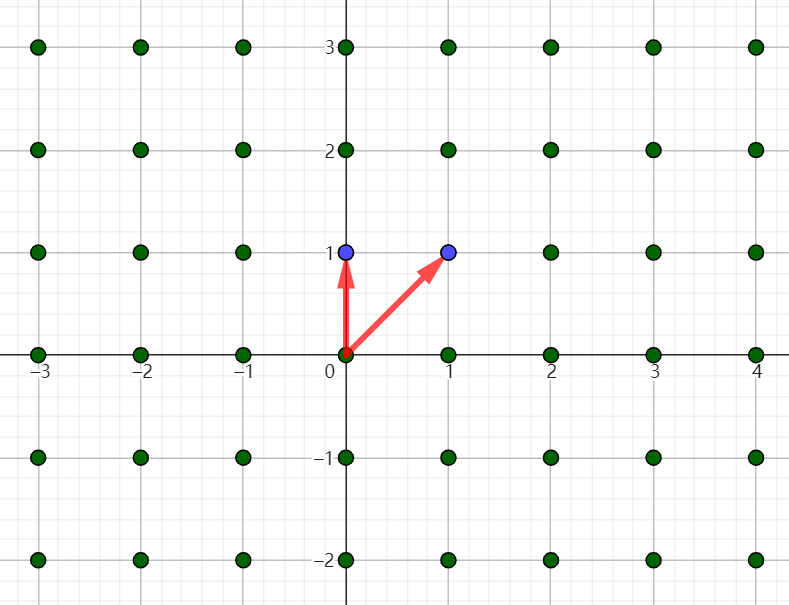
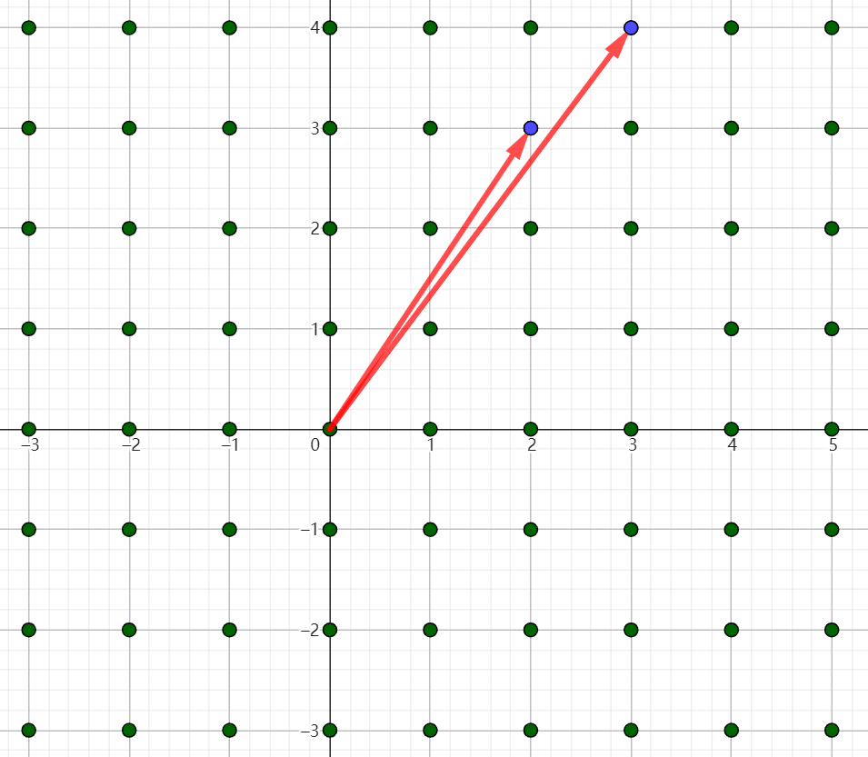
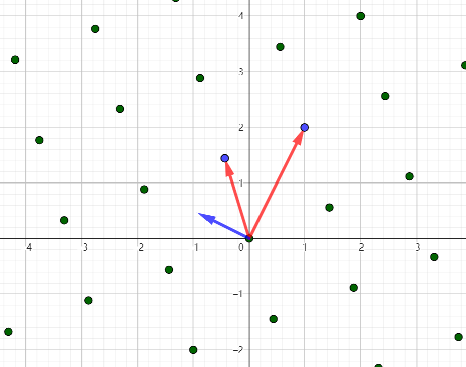
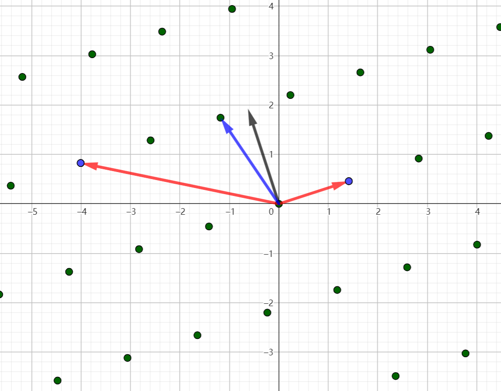
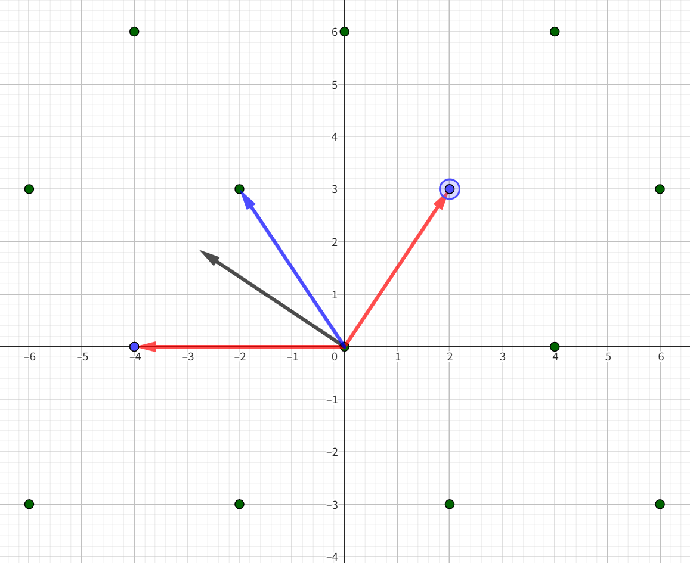
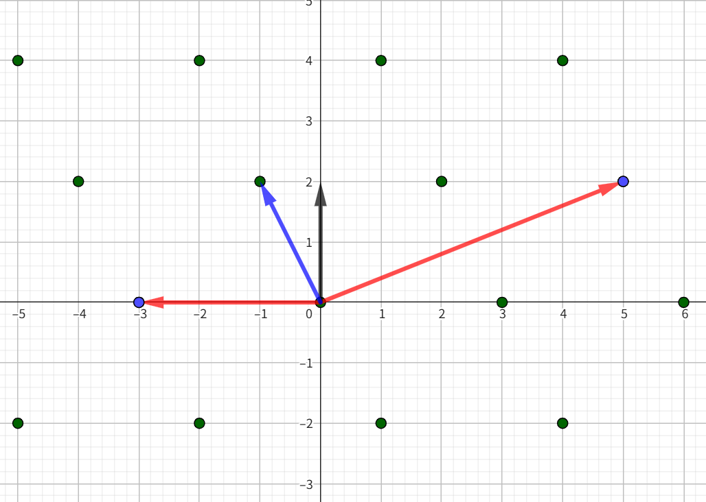
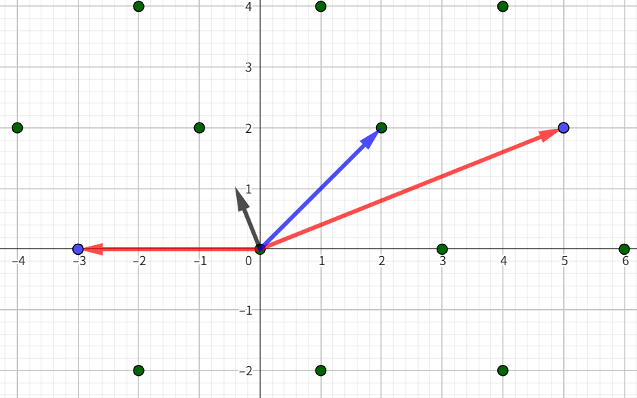

# 格密码

## 格

> 写在前面，后面的所有废话都是为了帮助更好的从数学上**理解**格而非**证明**格，所以肯定有地方说的不严谨甚至错误，另外部分的**显然**会忽略证明过程。

[我用了 Geogebra 来展示格的一些内容](https://www.geogebra.org/classic/gd46xsgy)

在最开始的最开始讲过有关线性代数的部分，其中有提到过关于矩阵的向量表示，这里的格指的就是一组基向量作为行向量构成的矩阵，以及这组基向量所张成的向量空间。

不过有所不同的是，这里的格张成的向量空间并非是连续的完整空间，而是一个个离散的点，通常是整数点。

例如在二维空间中如果有一组基为 $(1,1)$ 和 $(0,1)$，那么这个空间包含了这样的点



可能会发现，这些点可以由很多组不同的基向量张成，$(1,0)$和$(0,1)$等等。

也就是说你可以对这组基向量进行一系列的初等变化，这不会影响到这个格所张成的向量空间。

也就是说对于一些复杂的格，例如下图，这组基为$(2,3)$和$(3,4)$，可以通过一系列的初等变化，得到$(1,0)$和$(0,1)$，很显然这两组基的张成的向量空间是一样的。



格的行列式就是这组基向量构成的平行多面体的体积

### 最短向量

由于格上的点是离散的，所以除了零向量外肯定存在一个非零向量，其长度是最短的。

我们定义 $\lambda(\mathcal{L})$ 为格的最短非零向量长度。

要准确找到最短向量是一个 NP-hard 问题，但是我们可以近似的通过约束最短向量长度来近似得到最短向量。

首先我们可以尝试用**施密特正交化**来对这组格基进行处理，在二维平面中如下图，可以得到这样正交的一组基



能注意到经过正交化的向量长度给出了最短非零向量的下界，写作

$$
\lambda \geq min(||\vec{b_i}||)
$$

能注意到经过正交化处理后的向量并非一定在这个格上，那么为了能够在格上计算要对正交化后的系数进行取整，例如下图



于是就得到一组近似的正交基记作 $\tilde{b_i}$，于是

$$
\lambda \geq min(||\tilde{b_i}||)
$$

根据**Hermite 定理**有

$$
\lambda \leq \sqrt{n} \cdot \det(\mathcal{L})^{\frac{1}{n}}
$$

这个定理从理解上来说其实很好解释，仍然拿二维的一组基来分析，之前提到过格的行列式就是这组基向量构成的平行多面体的体积，这里的证明从略。当格确定时，这里的体积或者说行列式一定也确定了，那么要使得基向量最短，必须要求两个基向量尽可能正交，因为这里有 $\det(\mathcal{L})=\vec{a_1}\times \vec{a_2}=||\vec{a_1}||\cdot||\vec{a_2}||\cdot sin\theta$，当模长越小，自然要求夹角趋于垂直。

所以最理想的情况下有 $\lambda \leq \det(\mathcal{L})^{\frac{1}{n}}$

但考虑到格中离散的点并非是连续的，所以大多数情况下，并不能满足上式的上界



所以**Hermit 定理**在不等式中引入了一个参数 $\gamma_n^{\frac{1}{2}}$，通常取该值为 $\sqrt{n}$

$$
\lambda \leq \gamma_n^{\frac{1}{2}} \cdot \det(\mathcal{L})^{\frac{1}{n}}
$$

该定理给出了理论上的最短向量的上界。

### LLL

LLL 算法（Lenstra–Lenstra–Lovász 算法）是一种用于寻找格的短向量的算法。

算法主要的实现过程正是通过前文所述的施密特正交化，然后对其系数进行约简，以此得到近似的正交基。

此外还要注意一点的是在进行施密特正交化的时候，基向量的先后顺序会影响正交后的结果，例如下图，是分别对$\vec{a_1}$和$\vec{a_2}$进行正交化的结果





会发现上图正交化后是能输出最短向量的，而下图则把最短向量给错过了，于是在 LLL 算法中还要对正交化的结果进行限制

首先我们可以把施密特正交化写成这样的矩阵乘积的形式

$$
\left(\begin{matrix}
\vert &\vert &  &\vert\\
\vert &\vert &  &\vert\\
\vec{a_1} &\vec{a_2} & \cdots &\vec{a_i} \\
\vert &\vert &  &\vert\\
\vert &\vert &  &\vert\\
\end{matrix}\right)
=\left(\begin{matrix}
\vert &\vert &  &\vert\\
\vert &\vert &  &\vert\\
\tilde{b_1} &\tilde{b_2} & \cdots &\tilde{b_i} \\
\vert &\vert &  &\vert\\
\vert &\vert &  &\vert\\
\end{matrix}\right)
\left(\begin{matrix}
1 & u_{12} & u_{13} & \cdots & u_{1i}\\
0 & 1 & u_{23} & \cdots & u_{2i}\\
0 & 0 & 1 & \cdots & u_{3i}\\
\vdots & \vdots & \vdots & \ddots & \vdots\\
0 & 0 & 0 & \cdots & 1\\
\end{matrix}\right)
$$

为了限制施密特正交化的过程，要求

$$
\forall |u_{ij}| \leq \frac{1}{2}
$$

$$
\frac{3}{4}||\tilde{b_i}||^2 \leq ||\tilde{b_j} + |u_{ij}|\cdot \tilde{b_i}||^2
$$

如果不能满足就交换向量顺序，重新计算正交化

最终 LLL 算法就返回了一组近似的正交基向量 $\tilde{b_i}$，并且包含了可能的近似最短向量。

## SVP

SVP 问题（Shortest Vector Problem）是指在给定的格中，找到一个最短的非零向量。SVP 问题是一个 NP-hard 问题，通常使用 LLL 算法来近似求解。

在通常情况下，我们需要构造一个格 $\mathcal{L}$，然后能确定在这个格下有一个最短向量 $\vec{v}$，满足 Hermit 定理。并且找到这个最短向量在这个格下的系数向量 $\vec{u}$，如下

$$
\vec{u}\mathcal{L}=\vec{v}
$$

对这个格使用 LLL 算法进行格基规约，就能找到这个最短向量 $\vec{v}$

例如

有一个式子 $fh\equiv g\mod p$，已知$h$，$p$，其余均为未知量。那么就可以先将式子进行转换，得到

$$
fh+kp=g
$$

于是就能构造这样的格

$$
(f,k)
\left(\begin{matrix}
1 & h\\
0 & p\\
\end{matrix}\right)
=(f,g)
$$

为了确保能通过 LLL 算法得到想要的目标向量，就必须确保目标向量要满足最短向量的条件，于是要对目标向量和格计算，判断是否满足 Hermit 定理

如果满足的话，那么对格规约就有很大概率能得到想要的目标向量，于是就得到了 $f$，$g$

**[查看例题](./challenges/5.Lattice/SVP/task.py)**

## CVP

CVP 问题（Closest Vector Problem）是指在给定的格中，找到一个最接近给定向量的格向量。CVP 问题也是一个 NP-hard 问题，通常使用 Babai 最近平面算法来近似求解。

### Babai Algorithm

施工中...

```python
from sage.modules.free_module_integer import IntegerLattice

B = Matrix(ZZ, [[1, 0], [11, 1]])
t = vector([10, 10])

L = IntegerLattice(B)

v = L.closest_vector(t)

print(v)
```

## HNP

HNP 问题（Hidden Number Problem）这类问题造的格很有特点，通常是形如下图的，其中$K$是目标向量中的估计值

$$
\left(\begin{matrix}
n & 0 & \cdots & 0 & 0 & 0\\
0 & n & \cdots & 0 & 0 & 0\\
\vdots & \vdots & \ddots & \vdots & \vdots & \vdots\\
0 & 0 & \cdots & n & 0 & 0\\
a_1 & a_2 & \cdots & a_t & \frac{K}{n} & 0\\
b_1 & b_2 & \cdots & b_t & 0 & K\\
\end{matrix}\right)
$$

直接分析例题，这部分没有较为统一的解题方法，都是具体问题具体分析。

**[查看例题](./challenges/5.Lattice/HNP/task.py)**

整理式子可以得到这样的一组方程

$$
\left\{\begin{align*}
Cs_0&=a\cdot seed\ mod\ m\\
Cs_1&=a\cdot Cs_0+b_1\ mod\ m\\
\cdots\\
Cs_5&=a\cdot Cs_4+b_5\ mod\ m\\
\end{align*}\right.
$$

$$
b_i=Cs_i-a\cdot Cs_{i-1}+k_i\cdot m\\
$$

于是就能构造格

$$
(k_1,k_2,k_3,k_4,-a,1)
\left(\begin{matrix}
m&0&0&0&0&0\\
0&m&0&0&0&0\\
0&0&m&0&0&0\\
0&0&0&m&0&0\\
Cs_0&Cs_1&Cs_2&Cs_3&\frac{K}{m}&0\\
Cs_1&Cs_2&Cs_3&Cs_4&0&K
\end{matrix}\right)
= (b_1,b_2,b_3,b_4,a\cdot \frac{K}{m}, K)
$$

这里令$K$为和$b_i$一样规模的数。

## HSSP

### 问题描述

有一个大整数$M$，行向量$\alpha \in \mathbb{Z} _M^n$和一个由$n$个行向量$x_i \in \mathbb{Z} _2^m$构成的矩阵$A_{n \times m}$

计算$h=\alpha A$

已知$M,h,n,m$，求$\alpha , A$

其中满足$M.bits = 2 \iota n^2 + n \cdot log\ n,\iota = 0.035$

### 求解

**主要思路**：寻找 A 的正交格（因为 A 未知，于是要从 h 去构造），然后计算正交格的右核空间，并规约即可得到 A

寻找向量$u$使得$u,h$垂直

$$
h \cdot u = \alpha Au = \sum_{i=1}^n\alpha_i(x_i \cdot u) = 0\ mod\ M
$$

令向量$p_u$

$$
p_u=Au=(x_1u,x_2u,\cdots,x_nu)
$$

所以满足

$$
\alpha p_u=0\ mod\ M
$$

这表明$p_u$和$\alpha$在模 M 下相互垂直

当$p_u=0$时，即可认为$u$垂直于$A$的行向量$x_i$为基构成的格，即$u\in L_x^{\perp}$

由于$L_x$的维度是 n，因此$L_x^{\perp}$的维度是$m-n$，也就是说找到$m-n$个线性无关的$u$就能复原$L_x^{\perp}$，再计算出与其正交的格即可找到$L_x$，由于$x_i \in \mathbb{Z} _2^m$是短向量，对$L_x$规约即可得到构成矩阵$A$的基

$$
h\cdot u=\sum_{i=1}^mh_iu_i\ mod\ M
$$

可以尝试构造格，由于$p_u=0$可知$p_u$是短向量，而$x_i$的元素是$0,1$，所以$u$也是短向量

$$
(u_1,u_2,\cdots,u_m,-k)
\begin{pmatrix}
    h_1&     0&\cdots&     0&1\\
    h_2&     0&\cdots&     1&0\\
 \vdots&\vdots&\ddots&\vdots&\vdots\\
    h_m&     1&\cdots&     0&0\\
      M&     0&\cdots&     0&0\\
\end{pmatrix}
=(0,u_m,\cdots,u_2,u_1)
$$

还有一种构造格的方法

$$
h\cdot u=h_1u_1+\sum_{i=2}^mh_iu_i\ mod\ M
$$

$$
kM-\sum_{i=2}^mu_ih_ih_1^{-1}=u_1
$$

$$
(k,u_2,\cdots,u_m)
\begin{pmatrix}
           M&     0&\cdots&     0&0\\
-h_2h_1^{-1}&     1&\cdots&     0&0\\
      \vdots&\vdots&\ddots&\vdots&\vdots\\
-h_3h_1^{-1}&     0&\cdots&     1&0\\
-h_mh_1^{-1}&     0&\cdots&     0&1\\
\end{pmatrix}
=(u_1,u_2,\cdots,u_m)
$$

对$L_x$规约无法恢复矩阵$A$，因为矩阵$A$是在基上的进一步线性组合，不一定是最短基，所以可以通过类似背包密码的方式将基转化为$2x_i-e,e=(1,\cdots,1)$，以此筛选出目标基(元素落在$\{0,1\}$)，因为非目标基(元素落在$\{-1,0,1\}$)在新格中会使得模变长，而在规约中被筛去。此算法对数据大小有要求$m\ge \frac{n^2}{2}$

于是进行如下的构造

$$
B=\begin{pmatrix}-e\\2L_x\end{pmatrix}_{(n+1)\times m}
$$

令$L_x,A$存在如下线性关系

$$
UL_x=A
$$

于是有

$$
(e^T,U)_{n\times (n+1)}B=(2UL_x-e^Te)_{n\times m}=\begin{pmatrix} 2x_1-e\\\vdots\\2x_n-e \end{pmatrix}
$$

所以最终对$B$规约后去除加入的$e$的影响，即可恢复出矩阵$A$

## AHSSP

问题描述

有模数$p$，行向量$\alpha_{1 \times n} \in \mathbb{Z} _p^n$，一个由$n$个行向量$x_i \in \mathbb{Z} _2^m$构成的矩阵$A_{n \times m}$和行向量$e_{1 \times m}\in \mathbb{Z} _p^m$，$s$

计算$h = \alpha A-se\ mod\ p$，已知$h,e,p$，求$s$

求解

主要思路还是利用正交格来求解，然后之后的步骤和 HSSP 是大致相同的

构造正交矩阵$M$，使得满足$hM=\alpha AM-seM\ mod\ p$

构造如下的格对其规约，即可得到正交格 M

$$
(M_1,M_2,\cdots,M_m,k_1,k_2)
\left(\begin{array}{cc|cc}
   h_1&   e_1&     1&     0&\cdots&     0&0\\
   h_2&   e_2&     0&     1&\cdots&     0&0\\
\vdots&\vdots&\vdots&\vdots&\ddots&\vdots&\vdots\\
   h_m&   e_m&     0&     0&\cdots&     0&1\\
\hline
     p&     0&     0&     0&\cdots&     0&0\\
     0&     p&     0&     0&\cdots&     0&0\\
\end{array}\right)
=(0,0,M_1,M_2,\cdots,M_m)
$$

再采用和 HSSP 同样的方法即可恢复出 A

接下来再构造$eM=0\ mod\ p$，即可得到$hM=\alpha AM\ mod\ p$，然后就能解得$\alpha$，最终就能解出$s$

构造如下的格用来构造$M$，可能需要对第一列乘 p 进行配平

$$
(M_1,M_2,\cdots,M_m,k_1)
\left(\begin{array}{c|cc}
   e_1&     1&     0&\cdots&     0\\
   e_2&     0&     1&\cdots&     0\\
\vdots&\vdots&\vdots&\ddots&\vdots\\
   e_m&     0&     0&\cdots&     1\\
\hline
     p&     0&     0&\cdots&     0\\
\end{array}\right)
=(0,M_1,M_2,\cdots,M_m)
$$

## NTRU

施工中...

## LWE

LWE (Learning With Error) 容错学习问题是一种基于格的密码学难题，广泛应用于后量子密码学中。LWE 问题的核心思想是通过在一个线性方程组中引入噪声，使得解这个方程组变得困难。

LWE 问题通常可以表示成如下形式

$$
Ax+e=b\ mod\ p
$$

其中 e 是较小的误差向量，A 是已知的矩阵，b 是结果的向量，x 是未知数向量。

对于这样的问题通常的处理方法是，转化成 CVP 问题。例如将等式变形为如下形式

$$
Ax=b - e\ mod\ p
$$

由于误差向量通常是一个较小的向量，所以可以转化为 CVP 问题，通过寻找格中最接近向量 $b$ 的格向量来近似求 $b-e$ 从而求解 $x$ 

## RLWE

施工中...

## AGCD

AGCD(*Approximate Greatest Common Divisor*) 问题描述的是对于有误差的整数倍数求解最大公约数的问题。

对于普遍的最大公约数问题，给定整数$a_1,a_2,\cdots,a_n$，求它们的最大公约数$gcd(a_1,a_2,\cdots,a_n)$。可以使用欧几里得算法快速求解。

但是对于有误差的最大公约数问题，已知一组整数 $a_i=k_i\cdot p + e_i$，其中 $p$ 是未知的最大公约数，$k_i$ 是整数倍数，$e_i$ 是较小的误差项。目标是通过这些有误差的整数来近似求解出 $p$。

这里有两种方法可以解决。

### 丢番图近似格攻击 SDA

已知一组

$$
\left\{\begin{array}{}
a_0 = k_0 \cdot p + e_0\\
\cdots\\
a_i = k_i \cdot p + e_i
\end{array}\right.
$$

可以转换成这样的等式

$$
k_0a_i-k_ia_0 = k_0e_i-k_ie_0
$$

此类攻击方法有约束条件，需要满足下式（p的大小为 $\eta$ ，e的大小为 $\rho$ ，a的大小为 $\gamma$ ）

$$
l+1 > \frac{\gamma-\rho}{\eta-\rho}
$$


### 正交格攻击 OL

