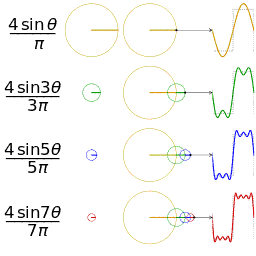

# Shor 量子算法

Shor 算法是 Peter Shor 在 1994 年提出的一个量子算法，主要用于整数分解和离散对数问题。它是第一个被证明在某些问题上比任何已知经典算法都快的量子算法，因此引起了广泛关注。论文链接：[Polynomial-Time Algorithms for Prime Factorization and Discrete Logarithms on a Quantum Computer](https://arxiv.org/abs/quant-ph/9508027)

## Shor 算法内容

对于一个整数 $N$，如果通过某种方法可以确定出在该有限整数域上的阶 $ord(N)$，那么就可以利用这个阶来分解 $N$

于是现在的问题转化成了如何快速计算阶

对于常规算法来说，计算阶的时间复杂度是指数级的，而 Shor 算法利用量子傅里叶变换等技术，可以在多项式时间内完成这个计算。

### Fourier Series 傅里叶级数

傅里叶级数（FS）是一个重要的数学工具，可以将一个周期函数表示为不同频率的正弦波和余弦波的叠加。对于一个周期为 $T$ 的函数 $f(t)$，它的傅里叶级数可以表示为：

$$
f(t) = \sum_{n=-\infty}^{\infty} a_n e^{ik\omega t}
$$

$$
a_n = \frac{1}{T} \int_{0}^{T} f(t) e^{-ik\omega t} dt
$$

例如对于最常见的周期时间序列（方波）可以分解成如下的正弦波叠加

```python {cmd hide matplotlib}
import numpy as np
import matplotlib.pyplot as plt

def fourier_step(t, steps):
    wave = np.zeros_like(t)
    for i in range(steps):
        n = 2 * i + 1
        wave += (1 / n) * np.sin(n * t)
    return (4 / np.pi) * wave

t = np.linspace(0, 4 * np.pi, 1000)
fig, ax = plt.subplots(figsize=(10, 3))

for i in range(1, 6):
    ax.plot(t, fourier_step(t, i), linewidth=1)

ax.set_xlim(0, 4 * np.pi)
ax.set_ylim(-1.3, 1.3)

ax.spines['top'].set_visible(False)
ax.spines['right'].set_visible(False)
ax.spines['left'].set_visible(False)
ax.spines['bottom'].set_position('center')
ax.get_yaxis().set_visible(False)

plt.subplots_adjust(left=0, right=1, top=1, bottom=0)

plt.show()
```



由此对于方波的傅里叶变换就可以写成下式

$$
f(t) = \frac{4}{\pi} \sum_{n=1}^{\infty} \frac{1}{2n-1} \sin((2n-1)t)
$$

傅里叶级数具有如下特点：

1. 只能用于表示周期函数
2. 频率是离散的

### Fourier Transform 傅里叶变换

傅里叶变换（FT）是一个重要的数学工具，可以将一个函数从时域转换到频域，揭示出函数中的频率成分。这里一般讨论的是连续傅里叶变换（CFT）

> 时域：信号关于时间 $t$ 的函数表示
> 频域：信号关于不同频率 $f$ 函数的分解

傅里叶变换可以看作是将傅里叶级数从周期函数上扩展到非周期函数上。因此傅里叶变换具有如下特点：

1. 可以用于任意函数
2. 频率是连续的

将非周期函数 $f(t)$ 看作是周期为 $\infty$ 的周期函数，于是就可以表示成下式

$$
\lim_{T\to \infty} a_nT = \lim_{T\to \infty}\int_{-\infty}^{\infty} f(t) e^{-ik\omega t} dt
$$

同时，在傅里叶级数中，频率是离散的原因在于，需要叠加出固定周期的函数。因此频率一定是目标频率的整数倍。然而对于非周期函数来说，频率可以是连续的任何数，于是就可以得到关于频率 $\omega$ 的函数

$$
F(\omega) = \lim_{T\to \infty} a_nT = \int_{-\infty}^{\infty} f(t) e^{-i\omega t} dt
$$

也可以由此看出傅里叶级数就是在傅里叶变换下的一种特殊情况

于是可以写出傅里叶变换的表示式

$$
f(t) = \int_{-\infty}^{\infty} F(\omega) e^{i\omega t} d\omega
$$

### Discrete Fourier Transform 离散傅里叶变换

离散傅里叶变换（DFT）是一个重要的数学工具，在信号处理、图像处理等领域有广泛应用。它将一个离散的时间序列转换为频域表示，揭示了序列中的频率成分。例如在计算机计算中是无法处理连续的时间序列，所以需要对时间采样进行离散化处理

### Fast Fourier Transform 快速傅里叶变换

一种用于计算离散傅里叶变换的快速算法

### Quantum Fourier Transform 量子傅里叶变换

量子傅里叶变换是 Shor 算法中的一个核心组件，它是经典离散傅里叶变换的量子版本。它可以在 $O(n^2)$ 的时间内完成，而经典算法需要 $O(n 2^n)$ 的时间。
