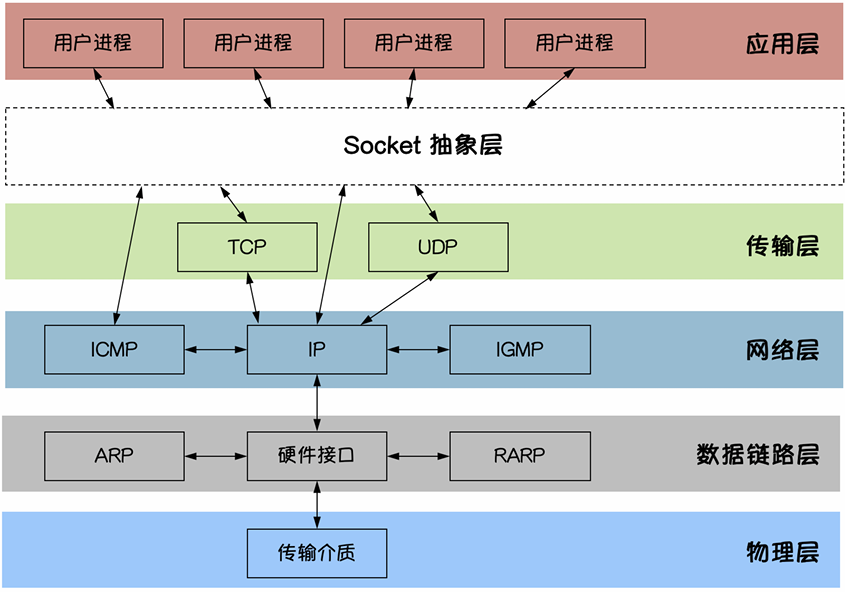
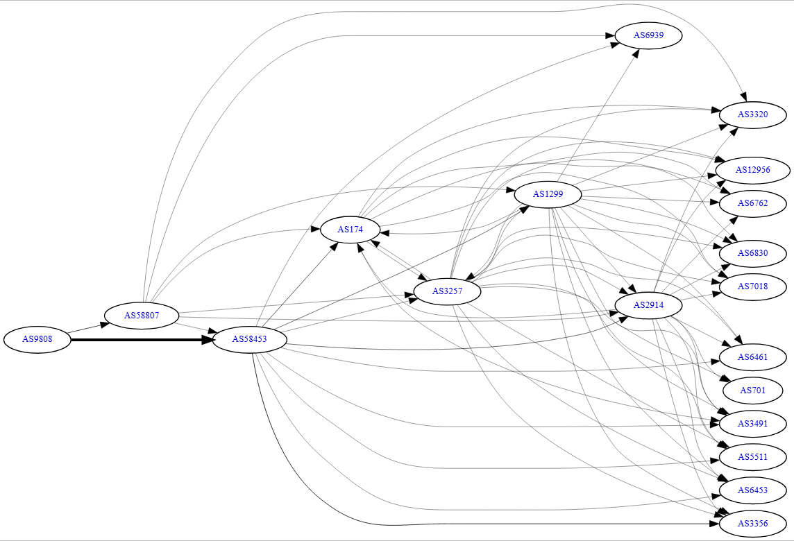

# 计算机网络

## 套接字



套接字（Socket）是计算机网络中用于实现进程间通信的一种机制。它提供了一种标准的接口，使得不同计算机上的进程能够通过网络进行数据交换。套接字可以支持多种协议，如TCP（传输控制协议）和UDP（用户数据报协议），并且可以在不同的操作系统上使用。

## UDP协议

UDP（User Datagram Protocol）是一种无连接的传输层协议，它提供了简单的消息传递服务。UDP不保证数据的可靠性、顺序和完整性，因此适用于那些对速度要求较高且可以容忍数据丢失的应用，如视频流、在线游戏等。

UDP 数据包由以下部分组成：

- 源端口号（16位）
- 目的端口号（16位）
- 长度（16位）
- 校验和（16位）
- 数据（可变长度）

## TCP协议

TCP（Transmission Control Protocol）是一种面向连接的传输层协议，它提供了可靠的数据传输服务。TCP通过建立连接、数据传输和连接终止三个阶段来确保数据的可靠性和顺序性。TCP适用于那些对数据完整性和可靠性要求较高的应用，如文件传输、电子邮件等。

采用了“三次握手”机制来建立连接，以及“四次挥手”机制来终止连接。

TCP 数据包由以下部分组成：

- 源端口号（16位）
- 目的端口号（16位）
- 序列号（32位）
- 确认号（32位）
- 数据偏移（4位）
- 保留（6位）
- 控制位（6位）
- 窗口大小（16位）
- 校验和（16位）
- 紧急指针（16位）
- 选项（可变长度）
- 数据（可变长度）

三次握手过程：

1. 客户端发送一个SYN（同步）包到服务器，表示请求建立连接。
2. 服务器收到SYN包后，回复一个SYN-ACK（同步-确认）包，表示同意建立连接。
3. 客户端收到SYN-ACK包后，回复一个ACK（确认）包，表示连接建立成功。

四次挥手过程：

1. 客户端发送一个FIN（结束）包到服务器，表示请求终止连接。
2. 服务器收到FIN包后，回复一个ACK包，表示确认收到终止请求。
3. 服务器发送一个FIN包到客户端，表示同意终止连接。
4. 客户端收到FIN包后，回复一个ACK包，表示确认收到终止请求，连接正式终止。

## 网络连接

### 连接链路

大陆网络优化，出网线路电信163移动CMI联通4837，三网CN2等等

首先得明白服务器是如何能访问上的，或者换句话说，IP之间是如何通信的，总不能说IPv4这么256**4个地址全部硬编码记录，然后直接查表访问吧

```Bash
┌──(sean㉿SEAN-LEGION)-[~]
└─$ sudo mtr -rwzc 100 121.40.28.126                                                                             0.214s
Start: 2026-05-13T14:50:51+0800
HOST: SEAN-LEGION                  Loss%   Snt   Last   Avg  Best  Wrst StDev
  1. AS???         SEAN-LEGION      0.0%   100    0.2   0.4   0.1   1.8   0.4
  2. AS???         192.168.101.1    0.0%   100    0.3   0.8   0.3  21.2   2.1
  3. AS???         100.84.224.1     0.0%   100    3.5   4.0   1.8  73.3   8.8
  4. AS56046       223.65.178.165  88.0%   100    2.6   2.9   2.5   3.4   0.3
  5. AS56046       112.4.15.161    21.0%   100    3.2   3.5   2.8   7.2   0.6
  6. AS9808        223.110.19.210  77.0%   100    4.4   4.9   4.1   6.6   0.7
  7. AS56046       36.155.156.206   0.0%   100   11.5   4.5   3.0  42.3   4.7
  8. AS???         10.54.125.26    90.0%   100   11.2  13.1  11.2  23.3   3.7
  9. AS???         ???             100.0   100    0.0   0.0   0.0   0.0   0.0
 10. AS???         ???             100.0   100    0.0   0.0   0.0   0.0   0.0
 11. AS???         ???             100.0   100    0.0   0.0   0.0   0.0   0.0
 12. AS37963       121.40.28.126    0.0%   100   13.0  13.1  12.5  14.6   0.4

┌──(sean㉿SEAN-LEGION)-[~]
└─$ sudo traceroute -I -n 121.40.28.126                                                                          129.7s
traceroute to 121.40.28.126 (121.40.28.126), 30 hops max, 60 byte packets
 1  172.28.16.1  0.291 ms  0.279 ms  0.278 ms
 2  192.168.101.1  0.394 ms  0.393 ms  0.392 ms
 3  100.84.224.1  2.705 ms  2.767 ms  2.912 ms
 4  223.65.178.165  3.334 ms * *
 5  112.4.15.161  4.174 ms * *
 6  * * *
 7  36.155.156.206  5.059 ms  5.077 ms  5.127 ms
 8  * * *
 9  * * *
10  * * *
11  * * *
12  121.40.28.126  12.814 ms  12.474 ms  12.812 ms
```

 **第 1-3 跳（家庭/企业内网）** ：

* `172.28.16.1` -> `192.168.101.1` -> `100.84.224.1`
* 因为在WSL上运行的，第一个IP先是WSL虚拟网卡中的宿主机IP，第二个是局域网网关，第三个是运营商内网IP
* 这是典型的多级路由环境（可能是大公司网络或复杂的家庭组网）。延迟极低（<5ms），说明本地网络非常稳定。

**第 4-7 跳（中国移动 CMI ** **骨干网**  **）** ：

* 通过 AS56046 (China Mobile)，AS9808 (China Mobile) 的移动骨干网

 **第 7 跳 -> 第 8 跳** ：

* 从移动骨干网 AS56046 进入 阿里 AS37963 的内网

 **第 11-12 跳（神秘的内网跳转）** ：

* 进入阿里 AS37963 后通过内网的转发，最终抵达服务器 IP

所以类似的，像如下的跨国通信也是一样的

```Bash
┌──(sean㉿SEAN-LEGION)-[~]
└─$ sudo mtr -rwzc 100 186.241.89.100                                                                            112.6s
Start: 2026-05-13T14:37:25+0800
HOST: SEAN-LEGION                  Loss%   Snt   Last   Avg  Best  Wrst StDev
  1. AS???         SEAN-LEGION      0.0%   100    0.3   0.5   0.2   2.0   0.4
  2. AS???         192.168.101.1    0.0%   100    0.6   0.7   0.3   2.6   0.4
  3. AS???         100.84.224.1     0.0%   100    2.8   4.0   1.9  10.9   2.1
  4. AS56046       183.213.91.57   91.0%   100    2.8   5.2   2.6  13.6   4.4
  5. AS9808        221.183.178.69  99.0%   100    8.8   8.8   8.8   8.8   0.0
  6. AS9808        221.183.89.53    9.0%   100   12.7  12.9  12.0  27.3   1.6
  7. AS9808        221.183.89.70   99.0%   100   83.8  83.8  83.8  83.8   0.0
  8. AS9808        221.183.89.173  71.0%   100   17.1  17.0  15.7  18.4   0.6
  9. AS58453       223.120.12.129   1.0%   100  206.5 203.4 201.1 281.7   8.8
 10. AS58453       223.120.6.18     3.0%   100  196.0 197.0 195.2 251.6   5.8
 11. AS???         10.0.4.2         3.0%   100  192.7 194.9 192.0 264.4   8.3
 12. AS???         192.168.230.69   5.0%   100  196.0 197.5 194.8 261.6   7.4
 13. AS???         10.250.0.3       6.0%   100  197.9 199.7 196.4 245.8   5.6
 14. AS400619      186.241.89.100   4.0%   100  199.6 204.2 198.9 285.0  11.3
 
┌──(sean㉿SEAN-LEGION)-[~]
└─$ sudo traceroute -I -n 186.241.89.100                                                                         142.7s
traceroute to 186.241.89.100 (186.241.89.100), 30 hops max, 60 byte packets
 1  172.28.16.1  0.540 ms  0.529 ms  0.529 ms
 2  192.168.101.1  0.937 ms  0.936 ms  0.935 ms
 3  100.84.224.1  3.237 ms  3.321 ms  3.421 ms
 4  * * *
 5  * * *
 6  * * *
 7  * * *
 8  221.183.89.173  19.104 ms  16.822 ms  16.780 ms
 9  223.120.12.129  202.104 ms  202.514 ms  202.500 ms
10  223.120.6.18  196.344 ms  196.108 ms  196.462 ms
11  10.0.4.2  193.519 ms  193.519 ms  193.569 ms
12  192.168.230.69  197.732 ms  197.987 ms  196.804 ms
13  10.250.0.3  197.680 ms  197.771 ms  197.918 ms
14  186.241.89.100  217.384 ms  214.166 ms  203.495 ms
```

 **第 1-3 跳（家庭/企业内网）** ：

* `172.28.16.1` -> `192.168.101.1` -> `100.84.224.1`
* 这是典型的多级路由环境（可能是大公司网络或复杂的家庭组网）。延迟极低（<5ms），说明本地网络非常稳定。

**第 4-8 跳（中国移动 ****CM** **NET 国内到 CMI 国际骨干网）** ：

* 通过 AS56046 (移动江苏骨干网)、AS9808 (移动境内骨干网)，数据包来到了 **国际出口关口局** 。
* 注意第 8 跳（`221.183.89.173`）延迟依然只有  **17ms** 。这说明此时数据包还在国内，可以查出来这是广东的出网口。

 **第 8 跳 -> 第 9 跳（跨越太平洋/大西洋）** ：

* **关键转折点** ：延迟从  **17ms 瞬间跳到了 203ms** 。这一跳直接来到移动的海外骨干网 AS58453 (移动CMI境外骨干网)
* 这意味着你的数据包在这里进入了 **跨海光缆** 。这 180ms+ 的差距就是光信号在几千公里海底光纤中穿梭的物理耗时。

 **第 11-13 跳（神秘的内网跳转）** ：

* 进入 AS400619 美国服务器商ISP后，出现了一组私有 IP（`10.x.x.x`, `192.168.x.x`）。
* 这说明目标机房（Hostcrazy Brasil）内部使用了多层 NAT 或内部交换路由。

再比如这个测试日本针对大陆方向优化的服务器

```Bash
┌──(sean㉿SEAN-LEGION)-[~]
└─$ sudo mtr -rwzc 100 154.36.181.55                                                                             0.081s
Start: 2026-06-02T21:41:50+0800
HOST: SEAN-LEGION                                      Loss%   Snt   Last   Avg  Best  Wrst StDev
  1. AS???         SEAN-LEGION                          0.0%   100    0.3   0.6   0.2   2.3   0.4
  2. AS???         192.168.101.1                        0.0%   100    0.5   0.7   0.3   2.2   0.4
  3. AS???         100.84.224.1                         0.0%   100    3.2   2.9   1.9   8.9   1.0
  4. AS56046       223.65.52.5                         97.0%   100    2.8   6.8   2.8  12.1   4.8
  5. AS???         ???                                 100.0   100    0.0   0.0   0.0   0.0   0.0
  6. AS9808        221.183.89.53                       98.0%   100   11.8  11.7  11.7  11.8   0.0
  7. AS9808        221.183.89.70                       99.0%   100   14.8  14.8  14.8  14.8   0.0
  8. AS9808        221.183.89.181                      68.0%   100   14.3  15.1  14.3  16.2   0.5
  9. AS58453       223.120.22.117                      90.0%   100   40.3  42.3  39.7  53.3   4.7
 10. AS58453       223.120.2.118                       93.0%   100   39.8  40.2  39.5  40.9   0.5
 11. AS3356        ae28.edge1.hkg3.sp.lumen.tech       16.0%   100   40.3  42.5  39.3 119.4   9.0
 12. AS3356        ae1.3508.edge4.Tokyo4.level3.net    12.0%   100   78.8  75.1  69.6 134.2   8.9
 13. AS7578        transit-edge.globalsecurelayer.com  14.0%   100   73.5  87.4  71.2 463.2  71.8
 14. AS???         ???                                 100.0   100    0.0   0.0   0.0   0.0   0.0
 15. AS???         10.81.100.6                          0.0%   100   65.4  67.6  65.1  96.9   5.7
 16. AS979         154.36.181.55                        0.0%   100   70.1  71.2  70.0  99.5   3.1
```

前面这两个例子会发现，在大陆网络出口之后直接就接入了对应海外地区的ISP网络，也就是常见的针对大陆的特殊优化，所以一般这类机房的连接延迟基本只受距离影响。

然而有一些机房没有专门做中国方向的优化，就会导致流量在多个AS自治域中来回转发，最终造成高延迟。比如没有做三网优化的香港服务器延迟普遍在200+ms，而接入和大陆网络对等ISP网络机房一般延迟在30~40ms左右。

```Bash
┌──(sean㉿SEAN-LEGION)-[~]
└─$ sudo mtr -rwzc 100 199.119.137.14                                                                            108.8s
Start: 2026-05-19T16:14:11+0800
HOST: SEAN-LEGION                                                  Loss%   Snt   Last   Avg  Best  Wrst StDev
  1. AS???         SEAN-LEGION                                      0.0%   100    0.2   0.2   0.2   1.6   0.2
  2. AS???         192.168.101.1                                    0.0%   100    0.6   0.6   0.3   1.6   0.2
  3. AS???         100.94.96.1                                      0.0%   100    2.1   3.5   1.9  60.0   6.1
  4. AS56046       223.65.52.133                                   65.0%   100    2.8   5.1   2.3  56.9   9.4
  5. AS9808        221.183.178.65                                  99.0%   100    4.8   4.8   4.8   4.8   0.0
  6. AS9808        221.183.89.57                                   76.0%   100    9.6  11.2   9.4  45.3   7.3
  7. AS9808        221.183.89.70                                   86.0%   100   14.5  14.3  13.9  14.7   0.3
  8. AS???         ???                                             100.0   100    0.0   0.0   0.0   0.0   0.0
  9. AS58453       223.120.12.121                                   1.0%   100  195.9 196.1 194.7 251.2   5.7
 10. AS58453       223.120.6.18                                     1.0%   100  195.7 195.4 193.8 247.2   5.3
 11. AS1299        lax-b22-link.ip.twelve99.net                     3.0%   100  197.5 198.7 196.0 244.7   8.1
 12. AS1299        lax-bb2-link.ip.twelve99.net                     1.0%   100  191.5 191.7 190.3 235.5   4.7
 13. AS1299        lax-b22-link.ip.twelve99.net                    28.0%   100  258.4 261.8 257.5 337.2  15.0
 14. AS1299        ash-bb2-link.ip.twelve99.net                     4.0%   100  267.8 265.8 264.3 319.6   5.7
 15. AS1299        ewr-bb2-link.ip.twelve99.net                     8.0%   100  259.2 259.6 258.2 308.9   5.3
 16. AS1299        ewr-b12-link.ip.twelve99.net                    11.0%   100  252.8 253.7 252.4 299.3   5.0
 17. AS1299        royalehostingbv-ic-391193.ip.twelve99-cust.net   1.0%   100  256.6 254.9 254.1 257.1   0.5
 18. AS1299        royalehostingbv-ic-391195.ip.twelve99-cust.net   4.0%   100  249.6 248.8 247.5 299.0   5.3
 19. AS212477      0.bb.0.edge.core.evo-ewr1.royalehosting.net      1.0%   100  257.3 256.8 255.7 298.5   4.3
 20. AS???         ???                                             100.0   100    0.0   0.0   0.0   0.0   0.0
 21. AS53724       14.137.119.199.in-addr.arpa                      1.0%   100  256.4 257.6 255.7 324.7   7.6
```

虽然AS自治系统的出现是为了更方便管理IP之间的通信，类似接线员的身份。但是一个AS也无法和全球所有AS连接上，两个AS系统间的关系主要分为三类，上游（Upstream）、下游（Downstream）、Peers（对等）

当两个AS系统之间无法直接访问，就需要第三方AS介入进行转发，这也就是为什么没有做中国方向优化的服务器延迟会高的原因。

例如上图的两个发往美国机房的请求，一个直接通过CMI网络直接进入机房所在ISP，而另一个通过CMI网络先发向在瑞典的AS1299，然后再发给荷兰的AS212477，最终才进入美国机房AS53724

下图就是CMNET的BGP AS拓扑关系图



### 常见骨干网

目前国内有三大ISP，电信、联通、移动，电信有2大骨干网——163和CN2，联通有2大骨干网——169和A网，移动只有1个骨干网CMNET，一共有5大骨干网。

AS4134   电信的163/4134骨干网自治系统编号

AS4809   电信的CN2/4809骨干网自治系统编号

AS4837   联通的169/4837骨干网自治系统编号

AS9929   联通的A网骨干网自治系统编号

AS56046 移动的江苏省省级网络自治系统编号

AS9808   移动的CMNET境内骨干网自治系统编号

AS58453 移动的CMI境外骨干网自治系统编号

AS4538   CERNET骨干网自治系统编号

AS7497   CSTNET骨干网自治系统编号

要注意一点的是，CMNET并没有和国外ISP有直接的互联，而是借助其境外骨干网CMI进行互联的。

在购买服务器时，都会给出服务器接入的骨干网，根据不同的骨干网，会有不同的连接质量和速度表现，通常来说，电信的CN2是比较优质的骨干网，适合需要高速稳定连接的用户，而移动的CMI则仅仅优于电信的163。但自然，越优质的骨干网价格对应服务器价格也只会越高。

## 内网穿透 & 异地组网

设想一下下列几种场景

1. 我的电脑开机放在家里，但我人在外面需要控制电脑或者传一些文件。
   可是我的家宽没有公网IP，使得我在外无法访问到家里的电脑
2. 我学校的网关设置了严格的防火墙，只允许特定端口访问
3. 我和我的好基友不在同一个局域网下，却想要MC联机（特指JAVA版）

### SSH 隧道穿透

#### -L 本地端口转发

`ssh -L [本地端口]:[远程端口] [远程用户]@[远程地址]`

`ssh -L [本地端口]:[目标地址]:[目标端口] [跳板机用户]@[跳板机地址]`

这两种命令写法，都是通过ssh将远程的端口转发到本地，从而可以直接通过 `localhost``:port` 对该端口发送请求等等。

例如，有一台局域网内的web服务器，只对 `127.0.0.1` 或局域网内开放，那么此时局域网外的电脑可以通过本地端口转发，将这台服务器的 80 或 443 端口转发到本地，于是可以通过 `127.0.0.1` 访问到web内容

通过SSH转发的端口一般默认只开放在 `127.0.0.1` 上，如果想要额外对局域网开放的活需要写成如下形式

`ssh -g -L [本地端口]:[目标地址]:[目标端口] [跳板机用户]@[跳板机地址]`

`ssh -L 0.0.0.0:[本地端口]:[目标地址]:[目标端口] [跳板机用户]@[跳板机地址]`

#### -R 远程端口转发

`ssh -R [远程端口]:[本地IP]:[本地端口] [跳板机用户]@[跳板机地址]`

这个命令可以将本地开放的端口通过SSH开放到跳板机上，以此可以通过访问跳板机的对应端口，从而直接访问到本地开放的服务

#### -D 动态端口转发

`ssh -D [本地端口] [跳板机用户]@[跳板机地址]`

这个可以直接固定一个端口用作全局的流量出口，并配合系统代理设置，可以将所有的流量从该本地端口发送到跳板机，再通过跳板机访问所有可达地址

最简单的系统代理设置，就是直接在命令行中指定代理

```Bash
# 设置 SOCKS5 代理（对应 ssh -D）
export all_proxy=socks5://127.0.0.1:7897

# 或者分别设置 HTTP 和 HTTPS
export http_proxy=http://127.0.0.1:7898
export https_proxy=http://127.0.0.1:7899
```

这里的变量设置是临时的，如果想要持久化的代理设置，可以对应的修改 `~/.bashrc` 这类文件

其他更多的代理设置方式，会在后面的工具介绍里提及

### Frp

frp实现的功能和上一节SSH中的作用大部分其实是一样的，但是会发现SSH的连接是一次性的，如果中间出现断连或波动，需要重新连接，而frp则不用担心。此外frp还有更多ssh不支持的功能，例如协议支持，多路复用等等

[[Github] fatedier/frp](https://github.com/fatedier/frp)

| **特性**       | **SSH -R**                     | **Frp**                                |
| -------------------- | ------------------------------------ | -------------------------------------------- |
| **稳定性**     | 易断线，需配合 AutoSSH，无内置重连。 | 内置连接池和心跳检测，重连极其稳定。         |
| **协议支持**   | 仅限 TCP。                           | TCP, UDP, HTTP, HTTPS, STCP 等。             |
| **多路复用**   | 一个映射通常对应一个 SSH 进程。      | 单条隧道多路复用，一个连接跑成百上千个端口。 |
| **应用层感知** | 无（只能按端口分）。                 | 强（支持按域名/Host 分发）。                 |
| **穿透能力**   | 仅限服务器转发（中转）。             | 支持 P2P 打洞 (xtcp)，流量不经过服务器。     |

frp分为两个部分frps和frpc分别用作服务端和客户端，这比 SSH 的单一进程更专业：

**frps (frp server):** 运行在拥有**公网****IP** 的服务器上。

* 它负责监听来自公网的请求，并管理所有的内网连接。

**frpc (frp client):** 运行在**内网设备**上。

* 它主动连接 `frps`，并告知：“我这里有哪些端口需要你帮忙发出去”。

frps/frpc启动时需要指定toml文件用作运行参数

`frpc -c ./xxx.toml`

#### 端口转发

同样的frp可以实现和ssh类似的端口转发的功能，这里展示一下最简单的转发配置

```TOML
# frps.toml
bindPort = 7000

auth.method = "token"
auth.token = "password"

webServer.addr = "0.0.0.0"
webServer.port = 7500
webServer.user = "admin"
webServer.password = "password"
```

```TOML
# frpc.toml
serverAddr = "x.x.x.x"
serverPort = 7000

auth.method = "token"
auth.token = "password"

[[proxies]]
name = "proxy1"
type = "tcp"
localIP = "127.0.0.1"
localPort = 5000
remotePort = 8000

[[proxies]]
name = "proxy2"
type = "tcp"
localIP = "127.0.0.1"
localPort = 5001
remotePort = 8001
```

#### 异地反向代理

不光可以进行端口转发，frp还可以用于异地反向代理，类似于Nginx的作用，但区别在于Nginx至少要求反代的服务器地址需要再一个网络内是可达的，但是frp可以通过内网穿透，将异地服务器用于反向代理。

```TOML
# frps.toml
bindPort = 7000
vhostHttpPort = 80
vhostHttpsPort = 443
```

```TOML
# frpc.toml
serverAddr = "x.x.x.x"
serverPort = 7000

[[proxies]]
name = "web-blog"
type = "http"
localIP = "127.0.0.1"
localPort = 8081
customDomains = ["blog.example.com"]

[[proxies]]
name = "web-cloud"
type = "https"
localIP = "127.0.0.1"
localPort = 8082
customDomains = ["cloud.example.com"]
```

这里的配置可以等效成如下Nginx配置

```Nginx
server {
    listen 80;
    listen 443 ssl;
    server_name blog.example.com;

    location / {
        proxy_pass http://127.0.0.1:8081;
    }
}

server {
    listen 443 ssl;
    server_name cloud.example.com;

    location / {
        proxy_pass http://127.0.0.1:8082;
    }
}
```

#### P2P打洞

前面描述的过程都需要经过公网服务器进行中转，将流量转发到本地。会占用服务器自身的带宽

frp还提供了另一种模式xtcp可以借助NAT在公网的地址，实现不经过公网服务器的P2P打洞

```TOML
# frps.toml
bindPort = 7000
bindUdpPort = 7001
```

```TOML
# frpc_provider.toml
serverAddr = "x.x.x.x"
serverPort = 7000

[[proxies]]
name = "p2p"
type = "xtcp"
localIP = "127.0.0.1"
localPort = 22
secretKey = "password"
```

```TOML
# frpc_visitor.toml
serverAddr = "x.x.x.x"
serverPort = 7000

[[visitors]]
name = "p2p_visitor"
type = "xtcp"
serverName = "p2p"
secretKey = "password"
bindAddr = "127.0.0.1"
bindPort = 6000
```

#### stcp端口转发

对于最简单的tcp转发模式，会直接将转发端口暴露在公网上，存在被扫描以及攻击的可能性，所以提出了一种更安全的stcp转发模式。该模式下只有在visitor端的frpc请求连接后才会在内部打通请求

```TOML
# frps.toml
bindPort = 7000
```

```TOML
# frpc_provider.toml
[[proxies]]
name = "stcp_proxy"
type = "stcp"
secretKey = "password"
localIP = "127.0.0.1"
localPort = 22
```

```TOML
# frpc_visitor.toml
[[visitors]]
name = "stcp_proxy_visitor"
type = "stcp"
serverName = "stcp_proxy"
secretKey = "password"
bindAddr = "127.0.0.1"
bindPort = 6000
```

### OpenVPN

OpenVPN 的本质是利用 **OpenSSL** 库来处理加密。它的工作逻辑和我们访问 HTTPS 网站非常相似。

**身份验证：** 它是基于 **证书体系 (PKI)** 的。服务端有一个 CA 根证书，每个客户端都有自己的证书和私钥。只有被 CA 签名的证书才能通过验证。

**虚拟网卡：** OpenVPN 在系统层创建虚拟网卡（TUN 或 TAP 设备）。（一般VPN软件都会创建一个虚拟网卡

**TCP/UDP 切换：** 默认跑在 UDP 1194 端口追求速度。但如果网络环境封锁了 UDP，它可以伪装成  **TCP 443 端口** 。

**HTTPS 伪装：** 在外表看来，它的流量和普通的网页浏览流量非常接近，很难被简单的防火墙规则直接切断。

在服务端部署好OpenVPN之后会生成一份 `.ovpn`文件，在客户端使用该份配置文件即可连接上服务端构建的虚拟局域网

### WireGuard

WireGuard同样也是一个VPN协议，和OpenVPN完全不一样。

前面所描述的OpenVPN的身份认证体系是依赖于服务端签发的证书，用于和客户端校验，会发现这里的证书和客户端是没有强关联的。

而WireGuard中采用了独立的公私钥对，每一个客户端会和服务端采用一对独立的公私钥，同时服务端也依赖公私钥对的关系建立客户端的索引

同时WireGuard的配置会比OpenVPN更简单，只需要确定好对应的公私钥即可

```TOML
# wg0.conf
[Interface]
PrivateKey = <服务端的私钥>
Address = 10.0.0.1/24
ListenPort = 51820

[Peer]
# peer1
PublicKey = <客户端 1 的公钥>
AllowedIPs = 10.0.0.2/32

[Peer]
# peer2
PublicKey = <客户端 2 的公钥>
AllowedIPs = 10.0.0.3/32

[Peer]
# peer3
...
```

```TOML
# peer1.conf
[Interface]
PrivateKey = <客户端 1 的私钥>
Address = 10.0.0.2/24
ListenPort = 51820

[Peer]
PublicKey = <服务端的公钥>
Endpoint = x.x.x.x:51820
AllowedIPs = 10.0.0.0/24
```

```TOML
# peer2.conf
[Interface]
PrivateKey = <客户端 2 的私钥>
Address = 10.0.0.3/24
ListenPort = 51820

[Peer]
PublicKey = <服务端的公钥>
Endpoint = x.x.x.x:51820
AllowedIPs = 10.0.0.0/24
```

然后这几台设备就在 `10.0.0.0/24`这个网段中可以相互通信了

> 1. **代理** 更像“某个应用程序的出口换了一条路”。
> 2. **VPN** 更像“系统多了一张网卡，所有流量都可以走这张网卡”。
>
> 所以如果你只是想让浏览器或某个命令走代理，通常不一定要上 VPN；但如果你想让远程桌面、文件共享、局域网发现这类东西都能正常工作，VPN 往往更自然。

### TailScale

Tailscale 是基于 WireGuard 协议构建的虚拟组网工具，在此基础上还实现了自动P2P打洞，从而绕过了中继服务器进行流量转发。如果多种打洞方式尝试失败后，会通过Tailscale的自己的中继服务器进行流量转发。

### RadminVPN

Radmin VPN是一个闭源的组网工具，免注册，无设备限制

### CloudFlare WARP

> 因为这个软件本身用途的特殊性，所以可以用做魔法工具

CloudFlare WARP 是 Cloudflare 公司推出的一款基于 **WireGuard** 协议的软件

WARP可以让你的所有请求通过最近的Cloudflare边缘服务器进行转发，从而隐藏真实的IP信息等。作用类似于代理服务器

### Proxychains

Proxychains 是 Linux 下的一个强制代理工具，可以强制将命令通过代理运行，而不关心这个命令是否支持代理。同时还可以对流量内容进行加密。此外还可以配置多个代理服务器构成的代理链，方便进行内网跳转

`proxychains4 <command>`

在该路径下是默认的 proxychains4 的配置文件 `/etc/proxychains4.conf`

```TOML
# proxychains4.conf
[ProxyList]
# 协议   IP地址       端口
socks5  127.0.0.1   1080
...
```

但是需要注意的是，这里 proxychains 不能和环境变量的配置共用，会出现请求同时经过proxychains和环境变量两个代理，会出现无法连接的情况

更多使用内容可以看这篇博客 [https://seandictionary.top/proxychains4/](https://seandictionary.top/proxychains4/)

### Proxifier

Proxifier 可以看作是带GUI的 proxychains 在MAC，Windows上的实现。

可以指定详细规则用于请求分流，也可以实现和 proxychains 一样的链式代理

### 其他的一些碎碎念

#### 网络请求

通常一个程序在联网时，大致流程如下：

```TOML
应用程序
↓
socket API(connect/send/recv)
↓
操作系统网络栈(TCP/IP)
↓
路由
↓
网卡
↓
互联网
```

然后上述讲到的所有工具，都是在这个链路上的某一环进行截获，然后转发。区别在于在那一层截获

例如

Linux 的环境变量是读取环境变量

Windows 系统代理是调用 WinINet/WinHTTP

Proxychains 通过劫持 libc 的网络模块然后注入自己的 libproxychains.so

Proxifier 也是和 Proxychains 类似，通过劫持软件的 socket 调用，然后强制走自己的代理链及规则分流

其余的 VPN 工具更多的是 网络层隧道，而非应用层代理

要注意的是有些不同的工具是全局代理，没有完整的规则分流，混用会造成代理链重合，出现一些无法访问的问题，例如 Proxychains 和系统环境变量同时使用

#### TUN/TAP

TUN/TAP 本质就是一张虚拟网卡，和 Docker，WSL，VM 等等的网络配置类似，都会在本机插入一张虚拟网卡，然后通过软件处理网卡的请求。

| **类型** | **工作层级** | **处理内容** |
| -------------- | ------------------ | ------------------ |
| TUN            | 三层（IP层）       | IP 包              |
| TAP            | 二层（以太网层）   | 以太网帧           |

虚拟网卡会将接收到的数据包发送到用户态程序上例如 Clash，OpenVPN 等等。

#### 代理协议

代理协议主要这几种，在 Linux 中设置环境变量的时候也能看到。
HTTP、HTTPS、SOCKS（SOCKS4，SOCKS5）

前两者好理解，代理的是HTTP/HTTPS的流量，但是所有的通信过程并不只是包含这两类流量，例如后端、数据库等等的通信。

所以 SOCKS 协议 是用来转发 UDP/TCP 流量的一个代理协议

> `ssh -D` 转发使用的默认是 socks 协议，而 win 的系统代理更多的用的是 HTTP/HTTPS 协议（或许这就是TUN模式更好用的原因（？

SOCKS4 不支持IPv6 不支持远程DNS 不支持UDP
